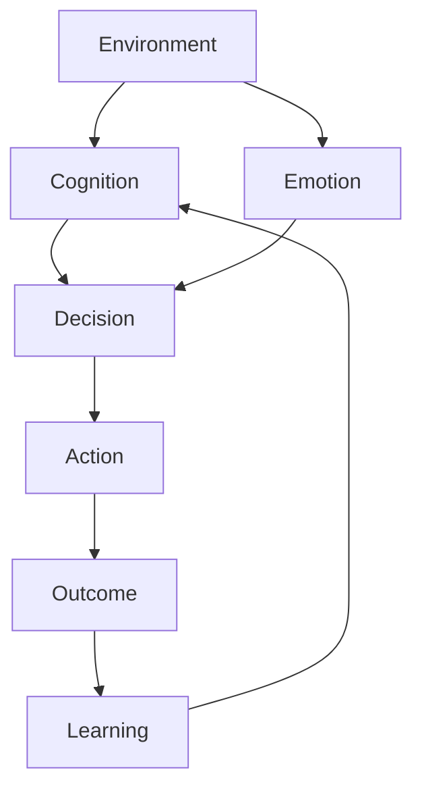

Human Behavior Map
人間行動を理解するには
心理を以下の 6領域に分解すると整理しやすい。
- [[02_zettelkasten/Zettelkasten Engine/02_knowledge/world_model/model/human/human/認知制約原理]]（Cognition）
- [[感情モデル]]（Emotion）
- [[動機]]（Motivation）
- [[02_zettelkasten/Zettelkasten Engine/02_knowledge/world_model/model/human/意思決定]]（Decision）
- [[02_zettelkasten/Zettelkasten Engine/02_knowledge/world_model/meta/model/human/human/社会性原理]]]（Social）
- [[学習モデル|学習モデル]]（Learning）
# 全体構造



## 1 Cognition（認知）
世界の理解。
主なテーマ
- [[知覚モデル]]
- [[注意]]
- [[記憶]]
- [[解釈モデル]]
- [[02_zettelkasten/Zettelkasten Engine/02_knowledge/world_model/meta/model/human/congnition/認知バイアス]]
代表理論
- [[情報処理]]
- [[二重過程理論]]
- [[02_zettelkasten/Zettelkasten Engine/02_knowledge/world_model/meta/model/human/congnition/限定合理性]]
## 2 Emotion（感情）
行動のエネルギー。
基本感情
- [[恐怖]]
- [[怒り]]
- [[喜び]]
- [[悲しみ]]
- [[期待]]
- [[嫌悪]]
- [[役割]]
価値判断
- [[意思決定促進]]
- [[記憶強化]]
## 3 Motivation（動機）
人を動かす力。
主な理論
- [[欲求理論]]
- [[期待価値理論]] 
- [[自己決定理論]]
基本欲求
- [[安全]]
- [[快楽]]
- [[承認]]
- [[所属]] 
- [[自己実現]]
# 4 Decision（意思決定）
選択のメカニズム。
主な理論
- [[期待効用]] 
- [[02_zettelkasten/Zettelkasten Engine/02_knowledge/world_model/model/human/プロスペクト理論]]
- [[02_zettelkasten/Zettelkasten Engine/02_knowledge/world_model/model/human/congnition/ヒューリスティック構造]] 
特徴
- [[02_zettelkasten/Zettelkasten Engine/02_knowledge/world_model/meta/model/human/congnition/限定合理性]]
- [[02_zettelkasten/Zettelkasten Engine/02_knowledge/world_model/meta/model/human/congnition/認知バイアス]]
## 5 Social（社会心理）
他者との関係。
主要テーマ
- [[信頼]]
- [[協力]]
- [[競争]]
- [[権威]]
- [[02_zettelkasten/Zettelkasten Engine/02_knowledge/world_model/meta/model/human/同調]]
- [[ステータス]]
代表理論
- [[02_zettelkasten/Zettelkasten Engine/02_knowledge/world_model/meta/model/human/社会的証明]]
- [[集団力学]]
- [[ ゲーム理論]]
## 6 Learning（学習）
行動更新。
学習メカニズム
- [[強化学習]]
- [[観察学習]]
- [[02_zettelkasten/Zettelkasten Engine/02_knowledge/world_model/meta/model/human/learning/習慣形成原理]]
- [[習慣構造]]

Cue
Routine
Reward
心理→社会の接続
このマップは社会科学と接続する。
```Mermaid
flowchart TD

A[Psychology]
A --> B[Behavior]
B --> C[Interaction]
C --> D[Social Structure]
D --> E[Institution]
```
