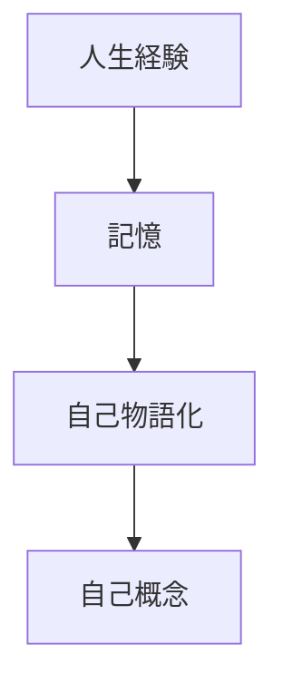

# Identity Model

アイデンティティとは、自分が何者であるかという自己認識である。

---

# アイデンティティ形成構造

---

# アイデンティティ要素

## 個人的要素

- 性格    
- 能力    
- 興味    

---

## 社会的要素

- 職業    
- 集団    
- 役割    

---

## 価値観

- 信念    
- 道徳    
- 人生観    

---

# アイデンティティの機能

## 行動の方向付け

例

- 「自分は研究者」    

---

## 意味形成

人生経験の統合

---

## 社会的安定

自己一貫性

---

# Human Behavior Model（統合）

Humanities OSのworld modelは

1. 環境
2. 注意
3. 知覚
4. 認知
5. 感情
6. 動機
7. 意思決定
8. 行動
9. 学習
10. 記憶
11. 自己