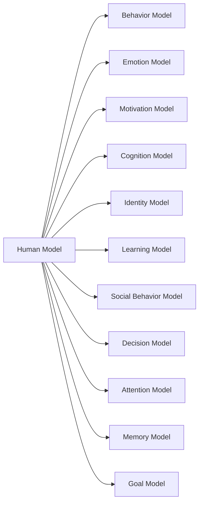

# Human Model Hub

Human Model は、人間の心理・行動・社会的存在としての構造を整理するモデル群である。  
ここでは人間を **行動・感情・動機・認知・自己・社会関係**といった観点から構造化する。

この層は以下と接続する。

- [[心理的原理 Hub]]
- [[人格モデル]]
- [[社会行動モデル]]

---

# 全体構造

---

# モデル一覧

## 行動

- [[行動モデル]]
- [[行動選択構造]]
- [[習慣構造]]
- [[02_zettelkasten/Zettelkasten Engine/01_knowledge/world_model/model/human/learning/行動強化]]

---

## 感情

- [[感情モデル]]
- [[感情生成構造]]
- [[感情調整構造]]
- [[情動反応構造]]

---

## 動機

- [[動機モデル]]
- [[欲求構造]]
- [[報酬構造]]
- [[期待価値モデル]]

---

## 認知

- [[認知モデル]]
- [[知覚構造]]
- [[02_zettelkasten/Zettelkasten Engine/01_knowledge/world_model/meta/model/human/congnition/認知バイアス]]
- [[02_zettelkasten/Zettelkasten Engine/01_knowledge/world_model/model/human/congnition/フレーミング効果]]

---

## 意思決定

- [[意思決定モデル]]
- [[限定合理性構造]]
- [[02_zettelkasten/Zettelkasten Engine/01_knowledge/world_model/model/human/プロスペクト理論]]
- [[満足化モデル]]

---

## アイデンティティ

- [[アイデンティティモデル]]
- [[自己概念構造]]
- [[役割アイデンティティ構造]]
- [[物語アイデンティティ構造]]

---

## 学習

- [[学習モデル]]
- [[強化学習構造]]
- [[模倣学習構造]]
- [[スキーマ形成構造]]

---

## 注意

- [[注意モデル]]
- [[注意配分構造]]
- [[02_zettelkasten/Zettelkasten Engine/01_knowledge/world_model/meta/model/social/constraints/注意資源制約]]

---

## 記憶

- [[記憶モデル]]
- [[短期記憶構造]]
- [[長期記憶構造]]
- [[想起構造]]

---

## 目標

- [[目標モデル]]
- [[目標設定構造]]
- [[目標追跡構造]]

---

## 社会行動

- [[社会行動モデル]]
- [[同調構造]]
- [[02_zettelkasten/Zettelkasten Engine/01_knowledge/world_model/meta/model/human/社会的証明]]
- [[02_zettelkasten/Zettelkasten Engine/01_knowledge/world_model/model/human/congnition/権威影響]]
- [[集団行動構造]]

---

# 関連ノート

- [[人格モデル]]
- [[心理的原理 Hub]]
- [[Human Behavior Map]]
