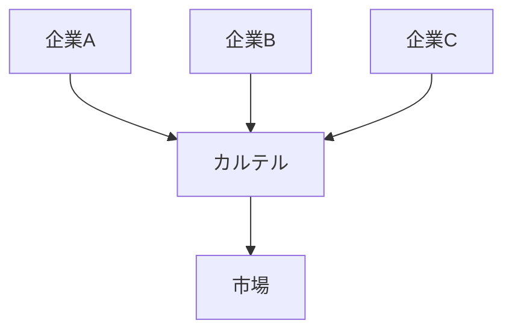
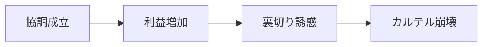
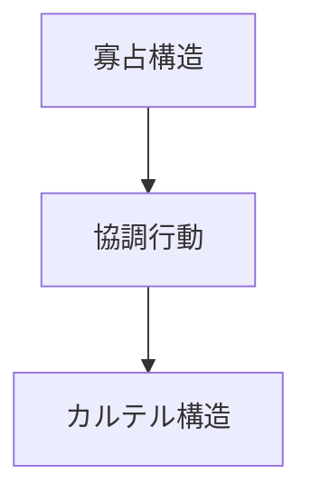

# カルテル構造

カルテル構造とは  
**複数の企業が協調して競争を制限する市場構造**である。

本来競争する企業が

- 価格
- 生産量
- 市場分割

について協調することで  
市場を共同で支配する。

多くの国ではカルテルは  
**独占禁止法によって禁止されている。**

---

# 基本構造

寡占市場では企業が協調することで  
事実上の独占状態が生まれる。

特徴

- 企業数は複数  
- 企業が協調行動  
- 市場競争が制限される  

---

# カルテルの目的

企業は次の目的でカルテルを形成する。

## 価格維持

価格競争を防ぎ  
高価格を維持する。

---

## 生産調整

生産量を制限して  
価格を安定させる。

---

## 市場分割

企業同士で市場を分ける。

例

- 地域分割
- 顧客分割
- 製品分割

---

# カルテルの種類

## 価格カルテル

企業が価格を共同で決定する。

---

## 生産カルテル

生産量を共同で調整する。

---

## 市場分割カルテル

市場を企業間で分ける。

---

## 入札カルテル

公共入札で企業が事前に落札者を決める。

---

# カルテルの不安定性

カルテルは内部崩壊しやすい。

理由

- 各企業が秘密裏に価格を下げる誘惑  
- 新規企業の参入  

---

# 典型例

歴史的カルテル

- 石油カルテル
- 鉄鋼カルテル
- 海運カルテル

現代の摘発例

- 建設入札談合
- 自動車部品価格カルテル

---

# 法規制

多くの国でカルテルは禁止されている。

主な制度

- 独占禁止法
- リーニエンシー制度（課徴金減免制度）
- 競争当局による摘発

---

# 寡占との関係

寡占市場では企業数が少ないため  
カルテルが成立しやすい。

---

# 関連ノート

- [[02_zettelkasten/未整理/model 1/world_model/03_social/competition/寡占構造]]
- [[市場支配構造]]
- [[02_zettelkasten/未整理/model 1/world_model/03_social/competition/競争構造]]
- [[規制捕獲構造]]

---

# 要点

カルテル構造とは

**企業が競争を制限するために協調する市場構造**

であり

- 価格維持
- 生産制限
- 市場分割

によって市場支配を強める仕組みである。