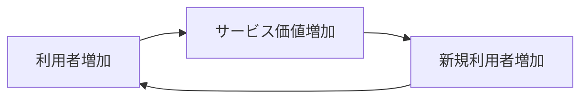
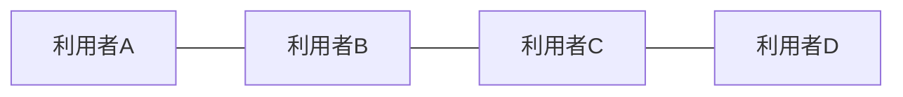
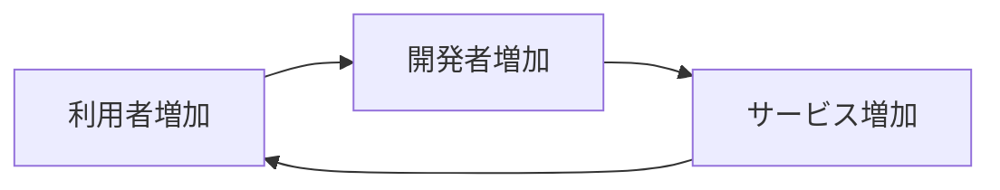
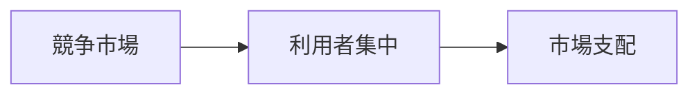
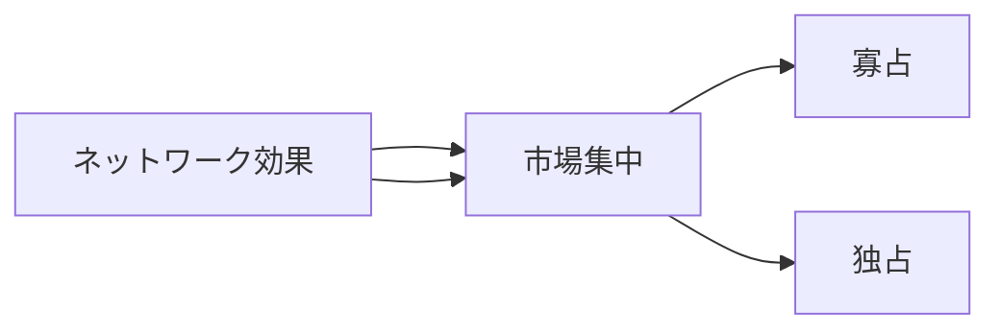

# ネットワーク効果構造

ネットワーク効果構造とは  
**利用者が増えるほどサービスの価値が高くなる構造**である。

通常の財では

- 利用者数  
- 価値  

は独立しているが、

ネットワーク効果では

**利用者数 → 価値**

という関係が生まれる。

そのため市場では

- 勝者総取り
- 市場集中

が起こりやすい。

---

# 基本構造

利用者が増えるほど  
サービスの価値が増加する。

この循環を

**ネットワーク効果ループ**

という。

---

# ネットワーク効果の種類

## 直接ネットワーク効果

利用者が増えるほど  
同じサービス利用者との価値が増える。

例

- 電話
- SNS
- メッセージアプリ

---

## 間接ネットワーク効果

利用者が増えることで  
関連サービスが増える。

例

- OS
- ゲーム機
- プラットフォーム

---

# ネットワーク効果の結果

## 市場集中

市場が一つの企業に集中する。

例

- Google
- Facebook
- Amazon

---

## 高い参入障壁

新規企業が市場に入りにくくなる。

理由

既存企業の利用者が多いため。

→ [[02_zettelkasten/未整理/model 1/world_model/03_social/competition/参入障壁構造]]

---

## 勝者総取り

市場の大部分が  
一企業に集中する。

---

# プラットフォーム市場

ネットワーク効果は  
プラットフォーム経済で特に重要である。

例

- SNS
- OS
- マーケットプレイス
- 配車アプリ

---

# 典型例

SNS

- Facebook
- X
- Instagram

OS

- Windows
- iOS
- Android

マーケットプレイス

- Amazon
- eBay

---

# 市場構造への影響

ネットワーク効果が強い市場では

---

# 政策問題

ネットワーク効果市場では  
規制が難しい。

理由

- 自然独占に近い
- 利用者利益も大きい

そのため

- 競争政策
- プラットフォーム規制

が議論されている。

---

# 関連ノート

- [[市場支配構造]]
- [[02_zettelkasten/未整理/model 1/world_model/03_social/competition/参入障壁構造]]
- [[02_zettelkasten/未整理/model 1/world_model/03_social/competition/寡占構造]]
- [[独占構造]]

---

# 要点

ネットワーク効果構造とは

**利用者数が増えるほどサービス価値が増加する構造**

であり

- プラットフォーム経済
- 市場集中
- 現代IT企業

を理解するための重要な市場構造である。