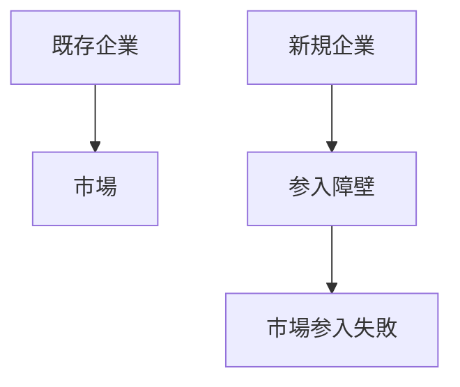
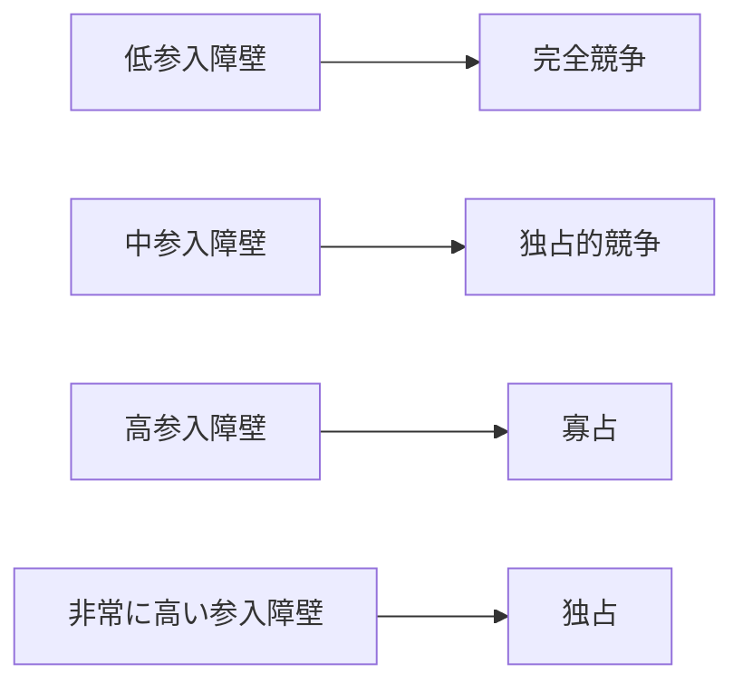

# 参入障壁構造

参入障壁構造とは  
**新規企業が市場に参入することを困難にする構造**である。

参入障壁が高い市場では

- 既存企業が市場を支配しやすい  
- 競争が弱くなる  
- 価格が高止まりする  

そのため参入障壁は  
**市場支配の最も重要な原因構造の一つ**である。

---

# 基本構造

参入障壁がある市場では  
既存企業が市場を維持しやすい。

---

# 参入障壁の種類

## 投資障壁

巨大な設備投資が必要になる。

例

- 半導体工場
- 航空機産業
- 鉄鋼産業

---

## 技術障壁

高度な技術が必要になる。

例

- 医薬品
- AI
- 半導体設計

---

## 規制障壁

政府規制が参入を制限する。

例

- 免許制度
- 認可制度
- 安全規制

---

## ブランド障壁

既存企業のブランドが強すぎる。

例

- Apple
- Nike
- Coca-Cola

---

## ネットワーク効果

利用者が多い企業ほど価値が高くなる。

例

- SNS
- OS
- プラットフォーム

---

# 戦略的参入障壁

既存企業が意図的に参入障壁を作る場合もある。

## 価格戦略

競争企業を排除するため  
一時的に価格を下げる。

---

## 大規模投資

市場を先に占有する。

---

## 特許取得

技術を独占する。

---

# 参入障壁と市場構造

参入障壁が高いほど  
市場支配は強くなる。

---

# 参入障壁の影響

## 競争減少

企業数が増えない。

---

## 価格上昇

競争が弱まり価格が高くなる。

---

## 技術停滞

企業の努力が弱くなる。

---

## 市場集中

少数企業が市場を支配する。

→ [[02_zettelkasten/未整理/model 1/world_model/03_social/competition/寡占構造]]

---

# 政策との関係

政府は次の政策で参入障壁を調整する。

- 規制緩和
- 独占禁止法
- 市場開放

---

# 関連ノート

- [[市場支配構造]]
- [[02_zettelkasten/未整理/model 1/world_model/03_social/competition/寡占構造]]
- [[独占構造]]
- [[02_zettelkasten/未整理/model 1/world_model/03_social/competition/競争構造]]

---

# 要点

参入障壁構造とは

**新規企業が市場に参入することを困難にする構造**

であり

- 市場集中
- 価格
- 競争状態

を決定する重要な市場構造である。