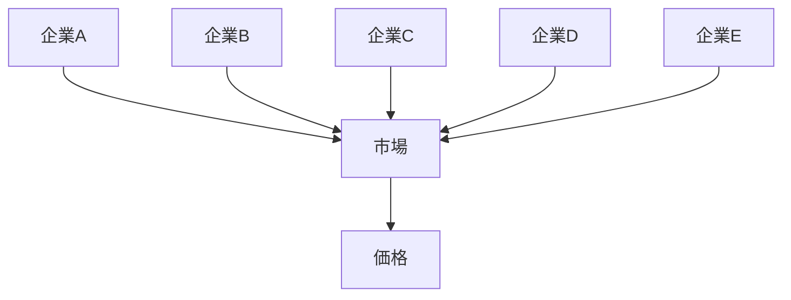
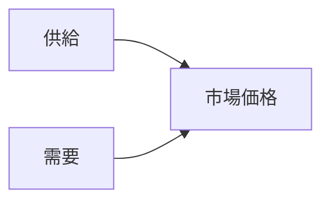
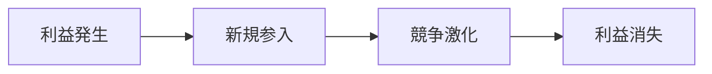
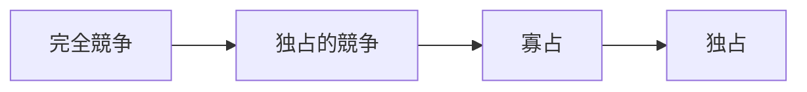

# 完全競争構造

完全競争構造とは、多数の企業が存在し、どの企業も市場価格に影響を与えられない競争構造である。
各企業は市場で決まる価格を受け入れるしかないため、企業は価格受容者（price taker）になる。

完全競争は現実では完全には成立しないが、 市場分析の基準モデル（ベンチマーク）として重要である。

---

# 基本構造

多数の企業と多数の消費者が存在し、  
誰も市場価格を支配できない。

特徴
- 企業数が非常に多い  
- 企業の市場支配力がない  
- 市場価格が自動的に決まる  

---

# 完全競争の条件

完全競争が成立するためには次の条件が必要である。

---

## 多数の企業

企業が非常に多いため、個々の企業は市場価格に影響できない。

---

## 製品の同質性

すべての企業が同じ商品を販売する。

例
- 小麦
- 米
- 原材料

---

## 自由な参入と退出

企業は自由に市場に入ったり退出したりできる。

結果
- 利益が出れば企業が増える  
- 利益が減れば企業が退出する  

---

## 完全情報

すべての市場参加者が、
- 価格
- 品質
- 取引条件
を完全に知っている。

---

# 価格形成

完全競争では価格は市場で決定される。

企業はこの価格を受け入れる。

---

# 企業の行動

企業は利益を最大化するために
- 生産量
- コスト
を調整する。

価格は企業が決めるのではなく、市場が決める。

---

# 長期均衡

完全競争では長期的に経済的利益はゼロになる。

理由
- 新規企業が参入するため  
- 価格が下がるため  

---

# 市場の例

完全競争に近い市場
- 農産物市場
- 原材料市場
- 商品先物市場

ただし現実では、完全競争はほとんど存在しない。

---

# 他の市場構造との違い

| 要素    | 完全競争  | 独占的競争 | 寡占    | 独占     |
| ----- | ----- | ----- | ----- | ------ |
| 企業数   | 非常に多い | 多い    | 少ない   | 非常に少ない |
| 製品差別化 | なし    | あり    | 場合による | なし     |
| 価格支配力 | なし    | 弱い    | 強い    | 非常に強い  |
| 参入障壁  | なし    | 低い    | 高い    | 非常に高い  |

---

# 競争構造の中での位置

左に行くほど競争が強い

右に行くほど市場支配力が強い

---

# 関連ノート

- [[02_zettelkasten/未整理/model 1/world_model/03_social/competition/競争構造]]
- [[独占的競争構造]]
- [[02_zettelkasten/未整理/model 1/world_model/03_social/competition/寡占構造]]
- [[独占構造]]

---

# 要点

完全競争構造とは、多数の企業が存在し、どの企業も市場価格を支配できない市場構造であり、

- 市場価格形成
- 効率的資源配分
- 経済分析の基準モデル

を理解するための基本構造である。