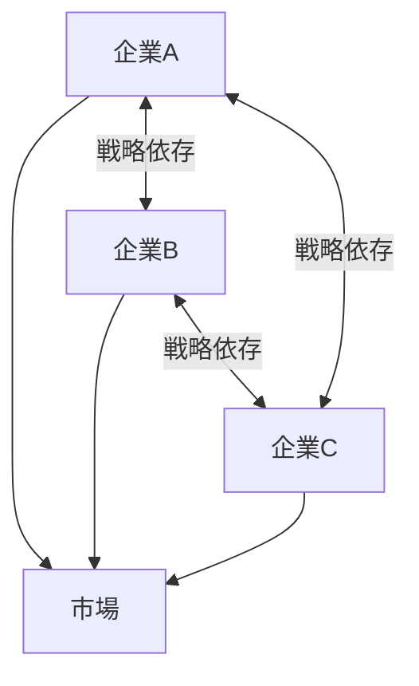
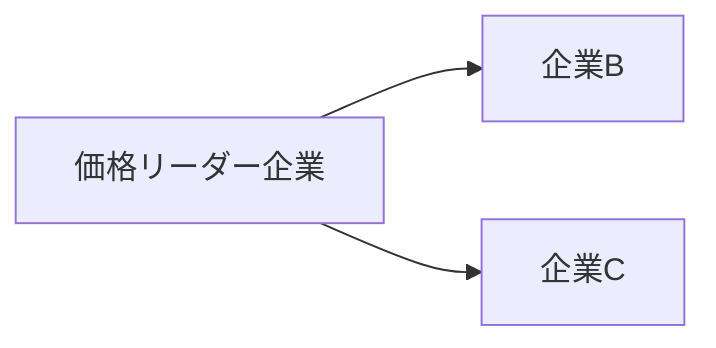
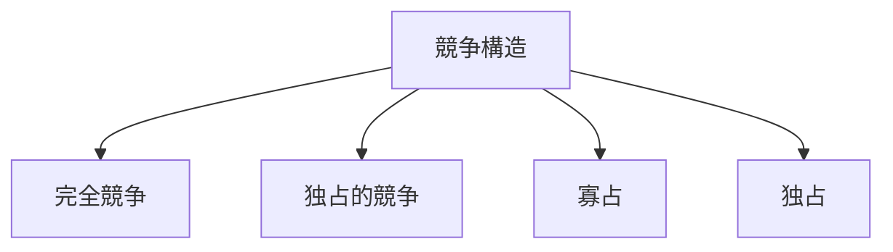

# 寡占構造

寡占構造とは、少数の企業が市場の大部分を支配する競争構造である。

完全競争と独占の中間に位置し、 企業同士が互いの行動を強く意識する相互依存的な競争が特徴となる。

企業数が少ないため、
- 価格競争が限定される
- 協調行動が起こりやすい
- 非価格競争が重要になる

---

# 基本構造

寡占市場では、少数企業が同一市場を共有し、互いの戦略を監視する。

特徴
- 少数企業による市場支配    
- 企業間の戦略的相互依存    
- 価格競争の抑制    

---

# 寡占が成立する条件

## 参入障壁

新規企業が市場に参入しにくい。

主な要因
- 巨額の初期投資    
- 技術独占    
- 規制    
- 特許    

例
- 航空機産業    
- 半導体産業    
- 通信産業    

---

## 規模の経済

生産量が増えるほどコストが低下する。

結果
- 大企業が有利になる    
- 小規模企業が参入しにくくなる    

例
- 自動車    
- 鉄鋼    
- 化学産業    

---

## ブランド支配

消費者が特定企業の製品を選び続ける。

例
- Apple    
- Coca-Cola    

---

## ネットワーク効果

利用者が増えるほど価値が高まる。

例
- SNS  
- OS    
- プラットフォーム    

---

# 寡占企業の行動パターン

## 価格リーダー制

一社が価格を設定し、他社が追随する。

例
- 石油産業    
- 鉄鋼産業    

---

## 暗黙の協調

企業同士が直接合意しなくても  
価格競争を避ける行動が起こる。

例
- 航空運賃    
- 携帯料金    

---

## 差別化競争

価格ではなく次の要素で競争する。

- ブランド    
- 技術    
- サービス    
- 広告    

---

# 寡占市場の典型例

航空機産業
- Boeing    
- Airbus    

OS市場
- Microsoft    
- Apple    
- Google    

半導体産業
- Intel    
- AMD    
- NVIDIA    

---

# 寡占の問題

## 価格上昇

競争が弱まり、価格が高止まりする。

## イノベーションの停滞

競争が弱まると技術革新が遅くなる。

## 政治的影響

巨大企業が政府に影響力を持つ。

→ [[規制捕獲構造]]

---

# 政策対応

政府は次の手段で寡占を規制する。

- 独占禁止法    
- カルテル規制    
- 企業分割    
- 市場開放    

---

# 競争構造の中での位置

# 関連ノート

- [[02_zettelkasten/未整理/model 1/world_model/03_social/competition/競争構造]]    
- [[市場支配構造]]    
- [[カルテル構造]]    
- [[規制捕獲構造]]    
- [[独占構造]]    

---

# 要点

寡占構造とは、少数企業が相互依存的に競争する市場構造であり、

- 市場支配    
- 企業協調    
- 政治的影響    

を理解するための重要な社会構造である。