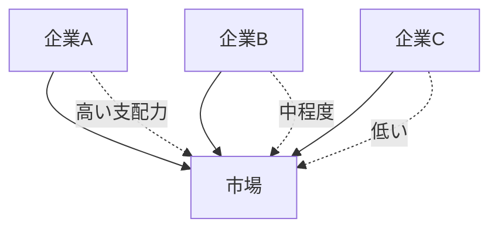
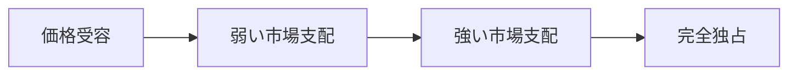
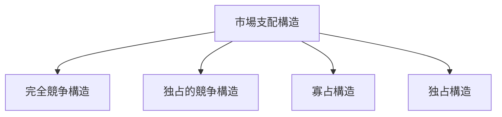

# 市場支配構造

市場支配構造とは、企業が市場価格や供給条件に影響を与える力の分布構造である。
企業が市場価格をどの程度コントロールできるかによって、市場の競争状態は大きく変わる。

市場支配力は次の要因によって生まれる。
- 市場シェア  
- 参入障壁  
- 技術支配  
- ブランド支配  
- ネットワーク効果  

---

# 基本構造

市場では企業ごとに市場支配力が異なる。

企業の市場支配力が強いほど価格決定力も強くなる。

---

# 市場支配力の段階

市場支配力は連続的に変化する。

対応する市場構造
- 完全競争  
- 独占的競争  
- 寡占  
- 独占  

---

# 市場支配力を生む要因

## 市場シェア

企業の販売量が市場で占める割合。
シェアが高いほど価格支配力が強くなる。

---

## 参入障壁

新規企業が市場に入りにくいほど既存企業の支配力は強くなる。

例
- 巨額投資
- 技術
- 規制
- ブランド

→ [[02_zettelkasten/未整理/model 1/world_model/03_social/competition/参入障壁構造]]

---

## 技術支配

企業が重要技術を持つ場合、競争企業が現れにくい。

例
- 半導体
- 医薬品

---

## ブランド支配

消費者が特定ブランドを選び続ける。

例
- Apple
- Nike

---

## ネットワーク効果

利用者が多いほど新規参入が困難になる。

例
- SNS
- OS
- プラットフォーム

---

# 市場支配の戦略

企業は次の手段で市場支配力を強める。

## 規模拡大

企業が生産規模を拡大する。

---

## 価格戦略

競争企業を排除するために低価格戦略を取る。

---

## 買収

競争企業を買収する。

---

## 技術投資

技術優位を確保する。

---

# 市場支配の問題

市場支配が強すぎる場合、次の問題が発生する。

## 価格上昇

消費者価格が高くなる。

---

## 競争低下

企業の努力が弱くなる。

---

## 政治影響

巨大企業が政治に影響する。

→ [[規制捕獲構造]]

---

# 政策対応

政府は市場支配を抑制するために  
次の政策を行う。

- 独占禁止法
- 企業分割
- 合併規制
- 市場監視

---

# 競争構造との関係

---

# 関連ノート

- [[02_zettelkasten/未整理/model 1/world_model/03_social/competition/競争構造]]
- [[02_zettelkasten/未整理/model 1/world_model/03_social/competition/寡占構造]]
- [[独占構造]]
- [[カルテル構造]]
- [[02_zettelkasten/未整理/model 1/world_model/03_social/competition/参入障壁構造]]

---

# 要点

市場支配構造とは、企業が市場価格や供給条件をどの程度支配できるかの構造であり、

- 競争状態
- 価格形成
- 産業構造

を理解するための中心的な市場構造である。