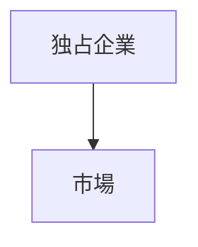
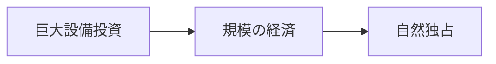
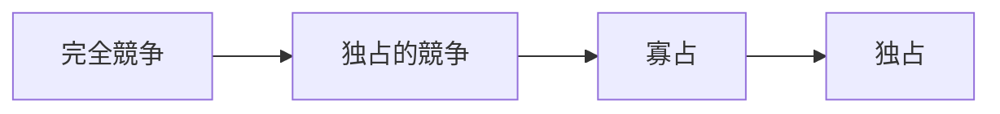

# 独占構造

独占構造とは、一つの企業が市場を支配している競争構造である。
競争企業が存在しないか、存在しても市場影響力を持たない。

そのため企業は、
- 価格
- 供給量
- 市場条件
を強く支配できる。

---

# 基本構造

独占市場では、企業が市場を単独で支配する。

特徴
- 企業が一社  
- 価格支配力が強い  
- 競争が存在しない  

---

# 独占が成立する条件

## 参入障壁

新規企業が市場に入れない。

要因
- 巨額投資
- 技術独占
- 特許
- 規制

---

## 技術独占

特定企業だけが技術を持つ。

例
- 医薬品特許
- 特殊技術産業

---

## 資源独占

企業が重要資源を支配する。

例
- 鉱山
- 石油資源

---

## ネットワーク効果

利用者が集中することで  
市場が一社に集約される。

例
- OS
- SNS
- プラットフォーム

---

# 自然独占

インフラ産業では、一企業だけが効率的になる場合がある。

例
- 電力
- 鉄道
- 水道
- ガス

→ [[自然独占構造]]

---

# 独占企業の行動

独占企業は次の行動をとる。

## 価格設定

競争市場より高い価格を設定する。

---

## 生産制限

供給量を制限して利益を最大化する。

---

## 参入阻止

新規企業の参入を防ぐ。

手段
- 特許
- 規制
- 投資拡大

---

# 独占の問題

## 消費者不利益

価格が上昇する。

---

## 効率低下

競争がないため企業効率が低下する。

---

## 政治影響

巨大企業が政治に影響力を持つ。

→ [[規制捕獲構造]]

---

# 政策対応

政府は独占に対して次の政策を行う。

- 独占禁止法
- 企業分割
- 価格規制
- 公営化

---

# 競争構造の中での位置

---

# 関連ノート

- [[02_zettelkasten/未整理/model 1/world_model/03_social/competition/競争構造]]
- [[02_zettelkasten/未整理/model 1/world_model/03_social/competition/寡占構造]]
- [[市場支配構造]]
- [[自然独占構造]]

---

# 要点

独占構造とは

**一企業が市場を支配する競争構造**

であり

- 価格支配
- 参入障壁
- 政治影響

を理解するための重要な市場構造である。