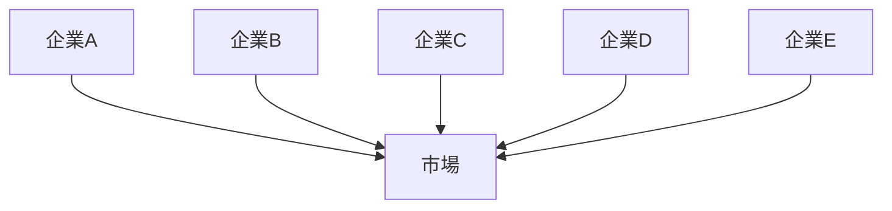
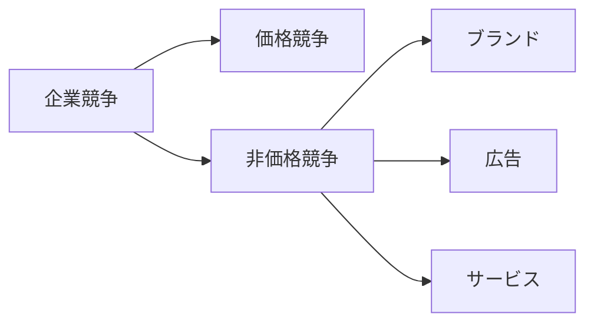
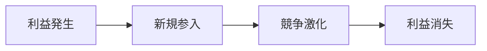
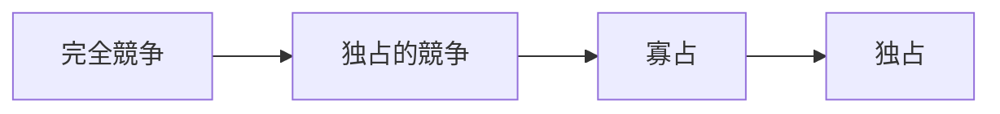

# 独占的競争構造

独占的競争構造とは、多数の企業が存在するが、製品差別化によって各企業が一定の市場支配力を持つ競争構造である。
企業数は多いため市場全体では競争が存在するが、個々の企業はブランドや製品特性によって独自の市場を持つ。

そのため
- 完全競争より価格支配力が強い
- 寡占より企業数が多い

という中間的な市場構造となる。

---

# 基本構造

多数の企業が存在し、それぞれが差別化された製品を提供する。

特徴
- 企業数が多い  
- 製品差別化が存在  
- ブランド競争  

---

# 製品差別化

企業は次の要素で差別化を行う。

## 品質

- 技術
- 素材
- 性能

---

## ブランド

企業イメージによって消費者を固定する。

例
- Nike
- Apple
- Starbucks

---

## デザイン

見た目や体験による差別化。

例
- アパレル
- 家具
- 自動車

---

## サービス

販売後のサービスや体験。

例
- レストラン
- ホテル
- 小売

---

# 価格競争と非価格競争

独占的競争では  
**非価格競争が重要になる。**

---

# 市場の例

独占的競争は多くの消費市場に存在する。

例

- レストラン
- カフェ
- アパレル
- 化粧品
- 家電

---

# 長期均衡

独占的競争市場では

- 新規参入
- 模倣

によって利益が消える傾向がある。

---

# 寡占との違い

|要素|独占的競争|寡占|
|---|---|---|
|企業数|多い|少ない|
|製品差別化|強い|場合による|
|企業相互依存|弱い|強い|
|参入障壁|低い|高い|

---

# 競争構造の中での位置

---

# 関連ノート

- [[02_zettelkasten/未整理/model 1/world_model/03_social/competition/競争構造]]
- [[完全競争構造]]
- [[02_zettelkasten/未整理/model 1/world_model/03_social/competition/寡占構造]]
- [[ブランド競争構造]]

---

# 要点

独占的競争構造とは

**多数企業が存在するが製品差別化によって部分的な市場支配力を持つ競争構造**

であり

- ブランド競争
- 製品差別化
- 非価格競争

を理解するための基本的な市場構造である。