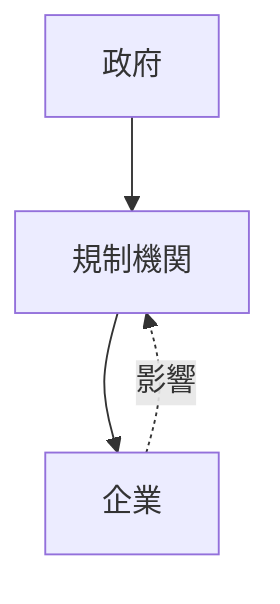

# 規制捕獲構造

規制捕獲構造とは  
**規制機関が本来監督する対象である企業や産業の利益を代表するようになる構造**である。

本来の目的

- 公共利益の保護
- 市場の公平性

が、次第に

- 産業保護
- 既存企業の利益

へと変化する。

この現象を **規制捕獲（Regulatory Capture）** と呼ぶ。

---

# 基本構造

企業と規制機関の関係が逆転する。



本来

政府 → 規制機関 → 企業

であるはずが

企業 → 規制機関 → 市場

という影響関係が生まれる。

---

# 規制捕獲の要因

## 情報非対称

規制機関は企業よりも専門知識が少ない。


---

## ロビー活動

企業が政治や官僚に影響を与える。

手段

- 政治献金
- 業界団体
- ロビー活動

---

## 天下り

官僚が退職後に企業に就職する。

結果

- 規制が緩和される
- 産業保護が進む

---

## 規制の複雑化

規制が複雑になるほど  
既存企業が有利になる。

理由

- 新規企業が対応できない
- 規制コストが高い

---

# 規制捕獲の結果

## 競争の低下

新規企業の参入が難しくなる。

---

## 価格上昇

企業が市場支配を強める。

---

## 技術革新の停滞

既存企業が保護される。

---

## 政治腐敗

企業と政治が癒着する。

---

# 典型例

規制捕獲は多くの産業で見られる。

例

- 金融業界
- 航空業界
- 電力業界
- 医薬業界

---

# 規制捕獲の構造

```mermaid
graph TD

企業 --> ロビー活動
ロ