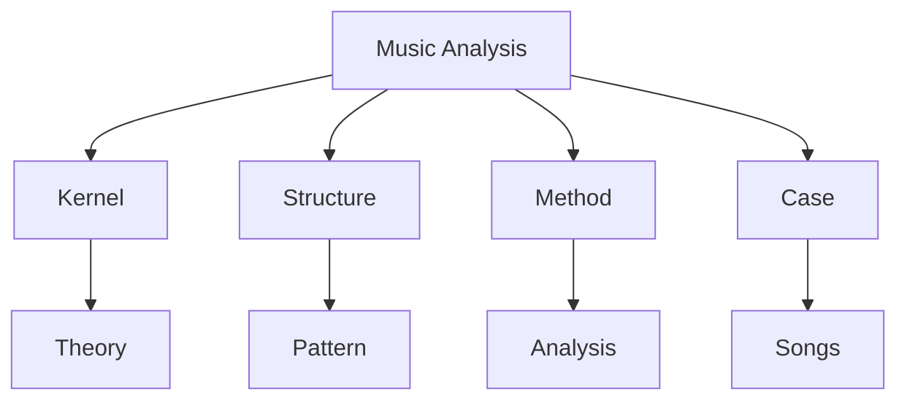
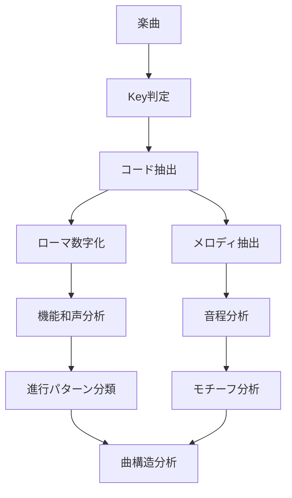
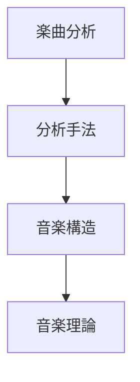

# Music Analysis Hub

このノートは  
**音楽（コード進行・メロディ・楽曲構造）を分析するZettelkastenの中心Hub**である。

目的は次の3つ。

1. 音楽理論の体系化  
2. 楽曲分析の蓄積  
3. 作曲パターンの抽出  

---

# 全体構造

1 Kernel（音楽の普遍原理）
音楽理論の基本原理。
ジャンルを超えて成立する。
調性
[[tonal_system]]
スケール
[[scale_structure]]
機能和声
[[harmonic_function]]
緊張と解決
[[tension_resolution]]
メロディ運動
[[melodic_motion]]
音度
[[scale_degree]]
和声進行原理
[[harmonic_motion]]
2 Structure（音楽構造）
楽曲を構成するパターン構造。
コード進行構造
[[chord_progression_structure]]
カデンツ
[[cadence_structure]]
モジュレーション
[[modulation_structure]]
フレーズ構造
[[phrase_structure]]
メロディ構造
[[melody_structure]]
曲構造
[[song_form_structure]]
3 Method（分析手法）
音楽を分析するための方法。
コード分析
[[chord_analysis_method]]
メロディ分析
[[melody_analysis_method]]
機能和声分析
[[harmonic_function_analysis]]
フレーズ分析
[[phrase_analysis_method]]
モジュレーション検出
[[modulation_detection]]
モチーフ分析
[[motif_analysis]]
4 Case（楽曲分析）
個別の楽曲分析ノート。
分析テンプレート
[[song_analysis_template]]
楽曲分析
例
[[song_blue_water_analysis]]
[[song_〇〇_analysis]]
分析フロー

コード進行パターン
代表進行
王道進行
コードをコピーする

I V vi IV
カノン進行
コードをコピーする

I V vi iii IV I IV V
251
コードをコピーする

ii V I
ロック下降進行
コードをコピーする

I ♭VII IV ♭III
メロディ分析軸
分析するときの視点
音程
順次進行
跳躍
リズム
強拍
弱拍
スケール
ダイアトニック
モード
解決
導音解決
テンション解決
曲構造
楽曲の形式
基本
AABA
ABAB
JPOP
Intro
Aメロ
Bメロ
サビ
クラシック
sonata form
rondo
Zettelkastenのリンク構造

このHubの役割
このHubは
音楽理論
分析手法
楽曲分析
を統合する。
最終的に
楽曲
↓
パターン
↓
理論
↓
作曲