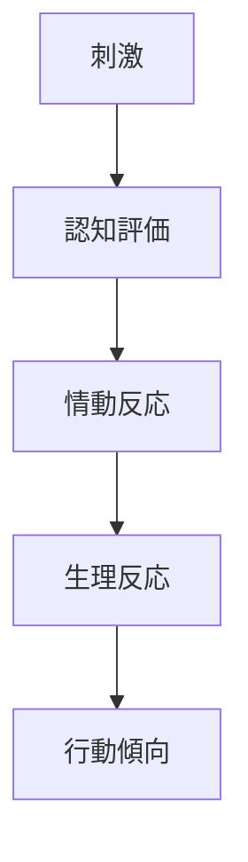
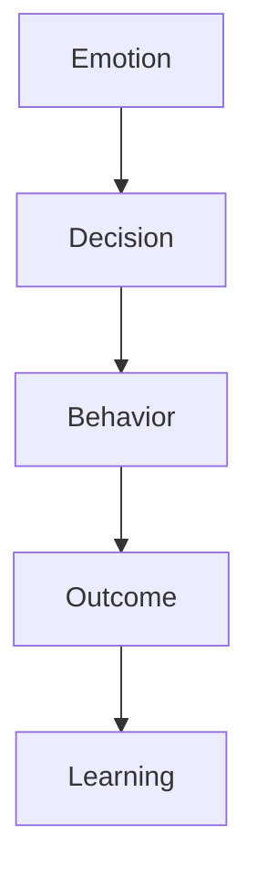
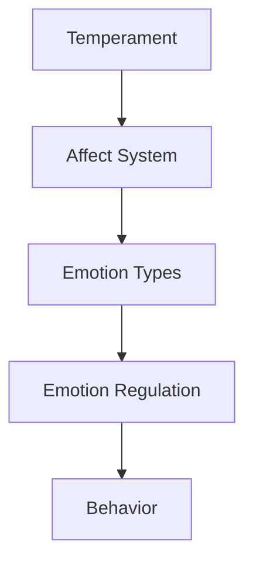

# Affect System

## 定義

Affect System（情動システム）とは、人間の感情を生み出し、調整し、行動へ接続する  神経・心理・行動の統合システムである。
このシステムは、
- 生理反応
- 主観的感情
- 行動傾向
を同時に生み出す。

---

## 基本構造

感情は次のプロセスで発生する。

情動は、環境への適応反応として働く。

---

## Affect と Emotion の違い

心理学では次の区別がある。

### Affect

広い意味の情動状態。

例
- 気分    
- 感情    
- 情動    

---

### Emotion

特定の出来事に対する短期的反応。

例
- 怒り    
- 喜び    
- 恐れ    

---

### Mood

長く続く情動状態。

例
- 憂鬱    
- 安心    
- 活気    

---

## 情動システムの構成

Affect Systemは次の要素から構成される。

### 感覚入力

外界の刺激。

例
- 視覚    
- 聴覚    
- 社会信号    

---

### 認知評価

出来事の意味づけ。

例
- 危険    
- 利益    
- 損失    

---

### 生理反応

身体反応。

例
- 心拍    
- ホルモン    
- 神経活動    

---

### 行動傾向

行動の準備。

例
- 接近    
- 回避    
- 攻撃    

---

## 情動の基本次元

感情は次の2軸で整理できる。

- Valence（快 / 不快）
- Arousal （高覚醒 / 低覚醒）

|     | 高覚醒 | 低覚醒 |
| --- | --- | --- |
| 快   | 興奮  | 安心  |
| 不快  | 怒り  | 悲しみ |

---
## 神経基盤

情動システムには次の脳領域が関与する。

### 扁桃体

恐怖反応。
### 前頭前皮質

感情制御。
### 視床下部

生理反応。
### 報酬系（ドーパミン）

快・動機。

---

## 情動システムと行動

情動は行動選択に影響する。

情動は、迅速な意思決定の補助として働く。

---

## 情動と人格

人格は情動システムの特徴によって違いが生まれる。

例
高反応性
- 不安    
- 神経症傾向    

低反応性
- 冷静    
- 情緒安定    

---

## 情動と社会

情動は社会関係に重要。

例
- 共感    
- 信頼    
- 攻撃    
- 協力    

---

## 人格OSとの関係

人格OSでは次の構造になる。

情動システムは、人格の感情エンジンとして働く。

---

## 関連ノート

[[emotion types]]
[[emotion regulation]]
[[気質]]
[[decision styles]]
[[drives]]