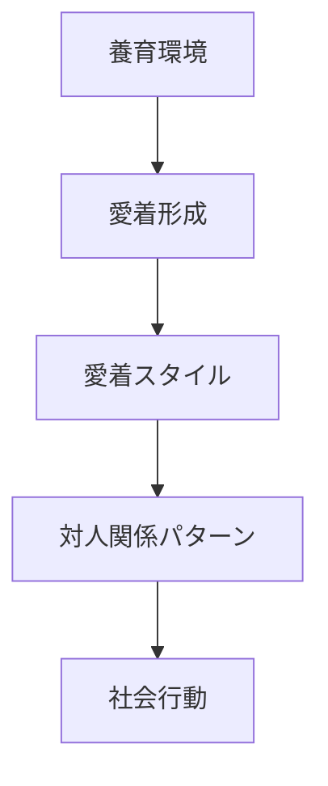
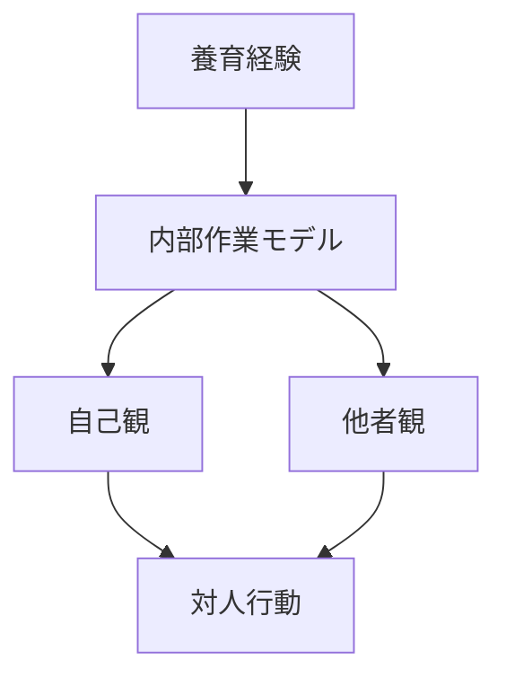
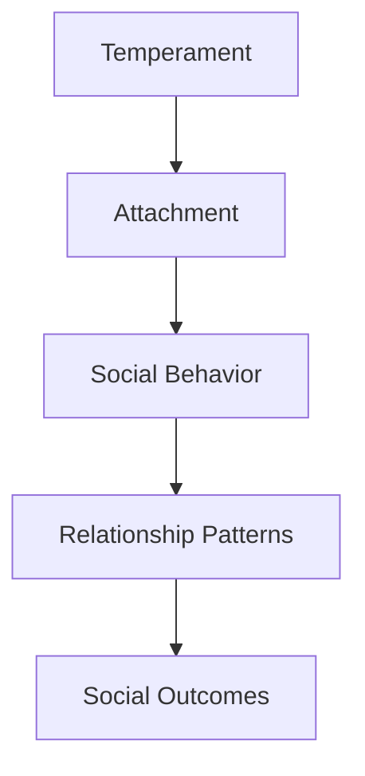

# Attachment Styles

## 定義

愛着（Attachment）とは、他者との心理的な結びつきに関する基本的な関係パターンである。
Attachment Style（愛着スタイル）は主に幼少期の養育関係を通じて形成され、その後の対人関係・信頼・親密性に強い影響を与える。

---

## 基本構造

幼少期の関係経験が、長期的な対人行動の基盤となる。
## 愛着理論

愛着理論は心理学者John Bowlbyによって提唱された。

乳児は、
- 安全    
- 保護    
- 安心    
を得るために養育者との心理的結びつきを形成する。

この関係が人間関係の基本モデル（Internal Working Model）になる。

---

## 主要な愛着スタイル

心理学では主に4タイプが提案されている。

---

### 安定型（Secure Attachment）

特徴
- 他者を信頼する    
- 親密関係を築きやすい    
- 感情調整が安定    

行動
- 協力    
- 信頼    
- 社会的安定    

---

### 回避型（Avoidant Attachment）

特徴
- 親密関係を避ける    
- 自立志向が強い    
- 感情表出が少ない    

行動
- 距離を取る    
- 自己依存    

---

### 不安型（Anxious Attachment）

特徴
- 拒絶への不安    
- 強い依存
- 感情変動    

行動
- 承認要求    
- 関係不安    

---

### 混乱型（Disorganized Attachment）

特徴
- 関係パターンが不安定    
- 矛盾した行動    

原因
- トラウマ    
- 不安定な養育    

---

## 愛着と内部作業モデル

人は愛着経験から、他者と自己に関する信念を形成する。

という基本信念を作る。

---

## 愛着と人格

愛着スタイルは人格に影響する。

例
安定型
- 協調性    
- 情緒安定    

回避型
- 独立志向    
- 感情抑制    

不安型
- 神経症傾向    
- 不安    

---

## 愛着と感情調整

愛着スタイルは感情調整能力にも影響する。

安定型
- 感情調整能力が高い    

不安型
- 感情過剰反応    

回避型
- 感情抑制    

---

## 愛着と社会関係

愛着スタイルは次の関係に影響する。
- 恋愛関係    
- 友人関係    
- 職場関係    
- 信頼形成
---
# 人格OSとの関係

愛着スタイルは

**人格OSにおける対人関係エンジン**

として働く。

---

## 関連ノート

[[social identity]]
[[cooperation behavior]]
[[emotion regulation]]
[[気質]]
[[人格特性]]