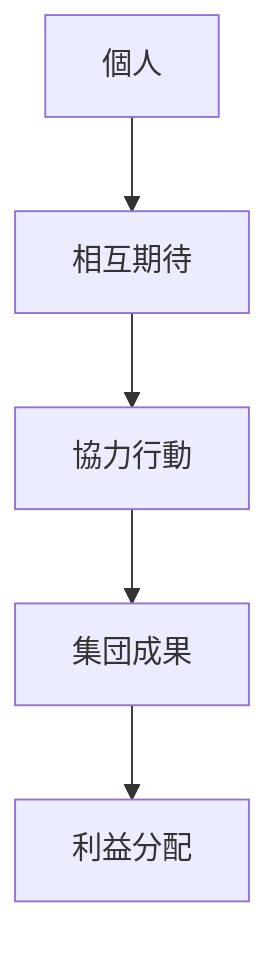
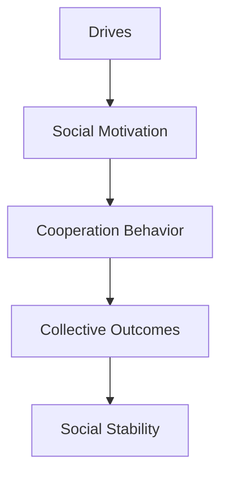

# Cooperation Behavior

## 定義

協力行動（Cooperation Behavior）とは、複数の個人が共通の利益または相互利益を得るために協調して行動することである。
人間社会の多くの制度・組織・文化は、協力行動を前提として成立している。

---

## 基本構造

協力は相互利益の期待によって成立する。

---

## 協力の進化的基盤

進化心理学では、協力は次の仕組みによって説明される。

### 互恵性（Reciprocity）

「助け合い」による協力。

例
- 今日助ける    
- 将来助けてもらう    

---

### 血縁選択

遺伝子共有による協力。

例
- 親子    
- 親族    

---

### 集団選択

協力的集団は生存しやすい。

---

## 協力の条件

協力が成立するには次の条件が重要。

### 信頼

相手が裏切らないと信じること。
### 評判

社会的評価が行動を制御する。
### 罰

裏切りへの制裁。
### 繰り返し関係

長期関係は協力を促進する。
## 協力とゲーム理論

協力研究では囚人のジレンマが有名。

状況
- 協力すると双方利益    
- 裏切ると個人利益    

結果、短期合理性は協力を破壊する。

---

## 協力戦略

研究では次の戦略が有効とされる。

### Tit-for-Tat

相手の行動をそのまま返す。
- 協力 → 協力  
- 裏切り → 裏切り
### 寛容戦略

たまの裏切りを許す。
### 評判ベース協力

評判に基づく協力。

---

## 協力と人格

人格特性は協力行動に影響する。

例
協調性（Agreeableness）
- 共感    
- 利他行動    

誠実性
- 約束遵守    

神経症傾向
- 不信    

---

## 協力と社会制度

社会制度は協力を促進する。

例
- 法律    
- 契約    
- 市場    
- 規範    

これらは協力の安定化装置として機能する。

---

## 協力と競争

協力と競争は対立しない。

多くの場合
- 集団内部 → 協力    
- 集団間 → 競争    
という構造になる。

---

## 人格OSとの関係

協力行動は、人格OSにおける社会協調モジュールである。

---

## 関連ノート

[[social identity]]
[[status behavior]]
[[人格特性]]
[[decision styles]]
[[drives]]