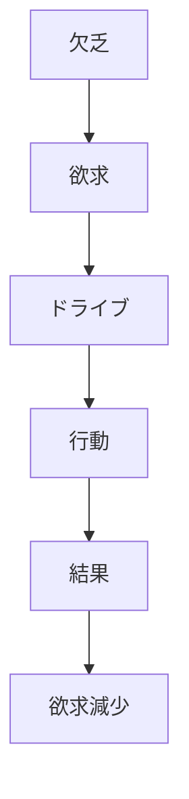
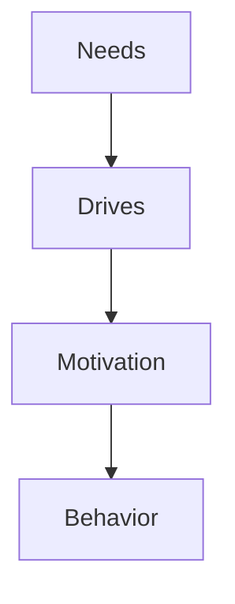
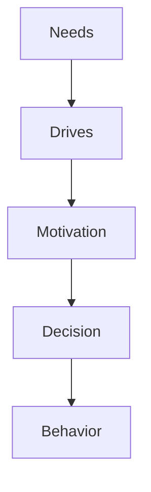

# Drives

## 定義

ドライブ（Drive）とは、欲求によって生じる行動を促す心理的エネルギーである。
欲求が「不足の認識」であるのに対し、ドライブは 行動を起こさせる推進力を指す。

---

## 基本構造

ドライブは次の行動プロセスで働く。

---

## ドライブ理論（Drive Theory）

古典的心理学では、行動はドライブによって説明された。

基本仮定
- 人間は不快状態を減らそうとする

この原理を

**恒常性（Homeostasis）**

という。

---

## ドライブの種類

### 生理的ドライブ

身体状態に由来する。

例
- 空腹
- 渇き
- 睡眠
- 性欲

---

### 心理的ドライブ

心理状態に由来する。

例
- 達成欲求
- 承認欲求
- 権力欲求
- 探索欲求

---

### 社会的ドライブ

社会環境から生まれる。

例
- 地位欲求
- 所属欲求
- 競争欲求

---

## ドライブと動機

心理学では、

という関係がある。
欲求は原因、ドライブは推進力である。

---

## ドライブと報酬

行動は、ドライブ強度 × 報酬期待 で強化される。

例
強い空腹 ＋ 食物の期待 → 強い行動動機

---

## ドライブ低減理論

Hullの理論では、行動 = ドライブ × 習慣 とされる。

ドライブが強いほど行動は起きやすい。

---

## ドライブと探索

現代心理学では、「ドライブ低減だけでは説明できない」ことが分かっている。

例
- 好奇心
- 探索
- 創造

これらは成長ドライブと呼ばれる。

---

## ドライブと人格

人格はドライブの優先順位で特徴づけられる。

例
達成ドライブ
- 努力
- 競争
- 成果志向

所属ドライブ
- 協調
- 社会志向

権力ドライブ
- 影響力
- 支配

---

## 人格OSとの関係

人格OSでは次の位置になる。

ドライブは、欲求を行動エネルギーに変換する機構である。

---

## 関連ノート

[[needs theory]]
[[motivation types]]
[[intrinsic extrinsic motivation]]
[[decision styles]]
[[Desire Principle]]
