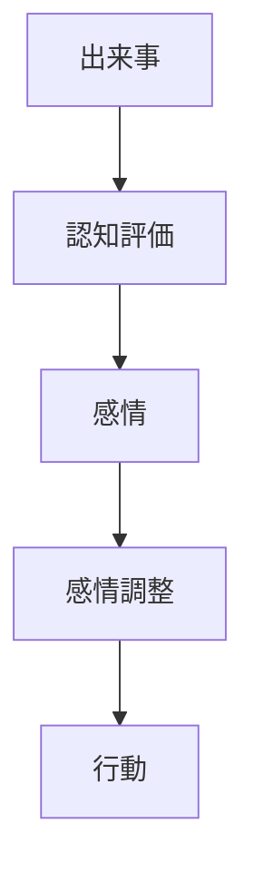
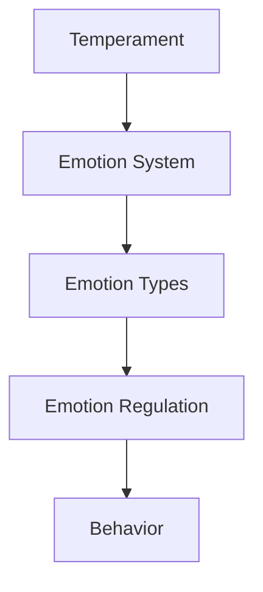

# Emotion Regulation

## 定義

感情調整（Emotion Regulation）とは、自分の感情の強さ・持続・表現を調整する心理過程である。
感情調整は、
- 感情を弱める
- 感情を強める
- 感情の表現を変える
などの方法で行われる。

---

## 基本構造

感情調整は次のプロセスで起こる。

人は感情そのものではなく、感情への反応を調整する。

---

## 感情調整の段階（Grossモデル）

心理学者 James Gross は、感情調整を次の段階で説明した。

### 1 状況選択

感情を生む状況を避ける / 選ぶ。

例
- ストレス環境を避ける

---

### 2 状況変更

状況を変える。

例
- 会話を変える
- 問題解決

---

### 3 注意調整

注意の向け方を変える。

例
- 気をそらす
- 集中

---

### 4 認知再評価

状況の意味を再解釈する。

例
- 失敗 → 学習機会

---

### 5 表出抑制

感情の表現を抑える。

例
- 怒りを隠す

---

## 感情調整の方法

心理学研究で重要とされる方法。

### 認知再評価

出来事の意味を変える。

効果
- ストレス低減
- 感情安定

---

### 表出抑制

感情を表に出さない。

効果
- 社会的衝突回避

欠点
- ストレス増加

---

### 注意転換

注意を別の対象へ向ける。

例
- 気晴らし

---

## 感情調整と人格

人格は感情調整能力に影響する。

例
- 誠実性→高い自己制御
- 神経症傾向→感情不安定

---

## 感情調整と社会

感情調整は社会関係に重要。

例
- 衝突回避
- 協力維持
- 信頼形成

---

## 感情調整と健康

研究では、感情調整能力は
- 精神健康
- ストレス耐性
- 人間関係
に影響する。

---

## 人格OSとの関係

人格OSでは次の位置になる。

感情調整は、感情を社会的行動に適合させる制御機構である。

---

## 関連ノート

[[emotion types]]
[[affect system]]
[[自己調整]]
[[気質]]
[[decision styles]]