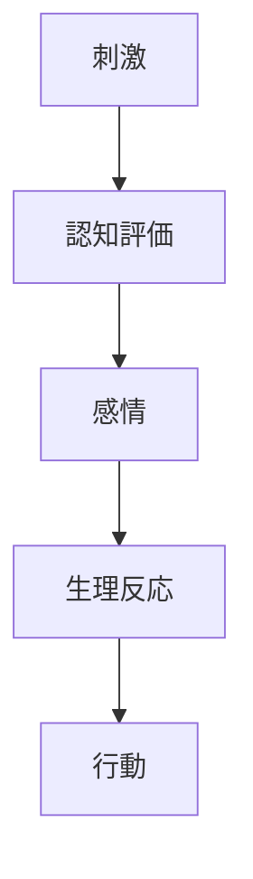
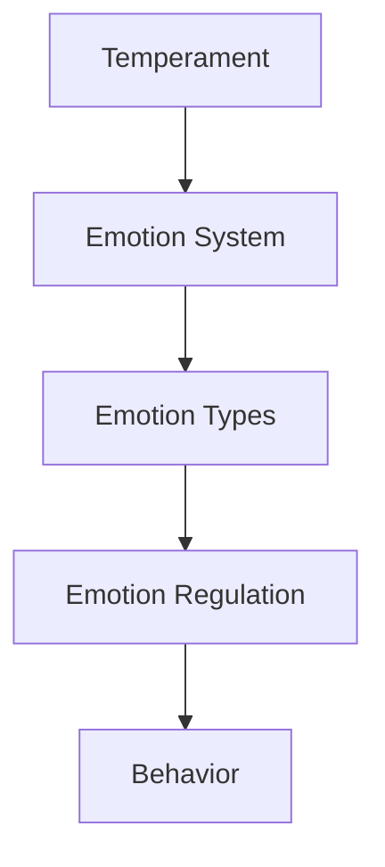

# Emotion Types

## 定義

感情（Emotion）とは、環境や出来事に対する評価によって生じる心理・生理・行動反応の統合的状態である。
感情は
- 行動の方向づけ
- 社会的コミュニケーション
- 意思決定
に重要な役割を持つ。

---

## 感情の基本構造

感情は次の要素から構成される。

感情は、「刺激そのもの」ではなく認知評価（appraisal）によって生じる。

---

## 基本感情（Basic Emotions）

心理学者ポール・エクマンは、人間には普遍的な基本感情があると提案した。

主な基本感情
- 喜び  
- 怒り  
- 悲しみ  
- 恐れ  
- 嫌悪  
- 驚き

これらは
- 表情
- 生理反応
が文化を超えて共通している。

---

## 感情の分類

感情はさまざまな軸で分類できる。

### 快 / 不快
快  
- 喜び  
- 満足

不快  
- 怒り  
- 悲しみ  
- 恐れ  
### 活性度  

高覚醒  
- 怒り  
- 興奮  
- 恐れ

低覚醒  
- 悲しみ  
- 安心  
- 疲労

---

### 社会感情

社会関係に関わる感情。

例
- 恥
- 罪悪感
- 嫉妬
- 誇り

---

## 感情の機能

感情には次の機能がある。

### 行動誘導

感情は行動を促す。

例
- 恐れ → 回避  
- 怒り → 攻撃  
- 喜び → 接近

---

### 社会的信号

感情表現は他者への情報になる。

例
- 怒り → 境界
- 悲しみ → 支援要請

---

### 意思決定補助

感情は直感判断
を助ける。

---

## 感情と人格

人格は

- 感情の強さ
- 感情の頻度
- 感情の持続

によって特徴づけられる。

例
神経症傾向
- 不安
- 心配
- ストレス反応

---

## 感情と意思決定

感情は意思決定に影響する。

例
- 恐れ→リスク回避
- 怒り→攻撃的判断
- 喜び→楽観的判断

---

## 感情と文化

感情表現は文化によって変わる。

例

- 表情抑制
- 感情表出

---

## 人格OSとの関係

人格OSでは次の位置になる。

感情は

**行動選択を調整するシステム**

である。

---

## 関連ノート

[[affect system]]
[[emotion regulation]]
[[気質]]
[[decision styles]]
[[motivation types]]