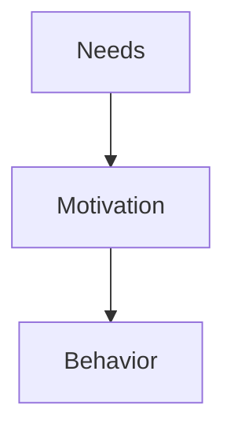
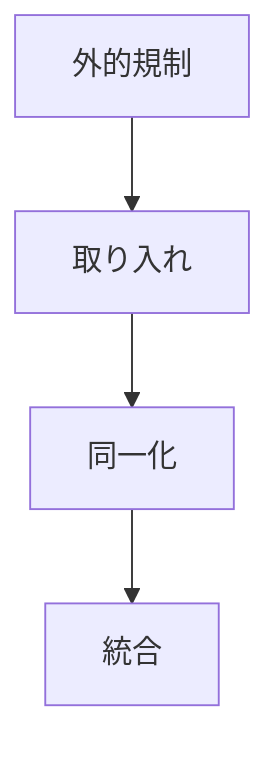
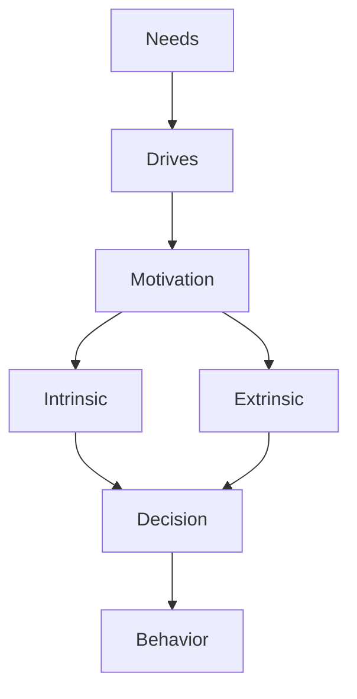

# Intrinsic Extrinsic Motivation

## 定義

動機は大きく内発的動機（Intrinsic Motivation）と、外発的動機（Extrinsic Motivation）に分類される。
この区別は現代心理学、特に Self-Determination Theory（自己決定理論）の中心概念である。

---

## 基本構造

動機には、
- 内発
- 外発
の二つの方向がある。

---

## 内発的動機（Intrinsic Motivation）

行動そのものが報酬になる動機。

### 例

- 知的好奇心
- 創作
- 探索
- 学習
- 問題解決

### 特徴

- 長期持続
- 創造性が高い
- 自律的

---

## 外発的動機（Extrinsic Motivation）

外部の結果によって行動する動機。

### 例

- 報酬
- 評価
- 昇進
- 罰の回避
- 社会的承認

### 特徴

- 即効性がある
- 行動制御に使われやすい
- 長期持続しないことがある

---

## 外発動機の段階

自己決定理論では、外発動機にも段階がある。

### 外的規制

報酬や罰による行動。

---

### 取り入れ

他者の評価を気にして行動。

---

### 同一化

価値を理解して行動。

---

### 統合

自己の価値体系に統合。

---

## 内発動機の条件

自己決定理論では、内発動機を強める要因は3つ。
- Autonomy（自律性）
- Competence（有能感）
- Relatedness（関係性）

この3つが満たされると内発動機が強くなる。

---

## 動機とパフォーマンス

研究では
- 短期成果 → 外発動機  
- 長期成果 → 内発動機
の傾向がある。

---

## 動機と人格

人格は、
- どの動機が強いか
- どの動機が優先されるか
によって特徴づけられる。

例
内発動機優位
- 研究者
- 芸術家

外発動機優位
- 営業
- 競技

---

## 動機と環境

環境は動機のタイプを変える。

### 外発環境

- 報酬制度
- 罰
- 評価

---

### 内発環境

- 自由度
- 探索機会
- 挑戦

---

## 人格OSとの関係

人格OSでは次の位置になる。

内発動機は持続的行動のエンジンとなる。

---

## 関連ノート

[[motivation types]]
[[needs theory]]
[[drives]]
[[自己効用感]]
[[自己調整]]