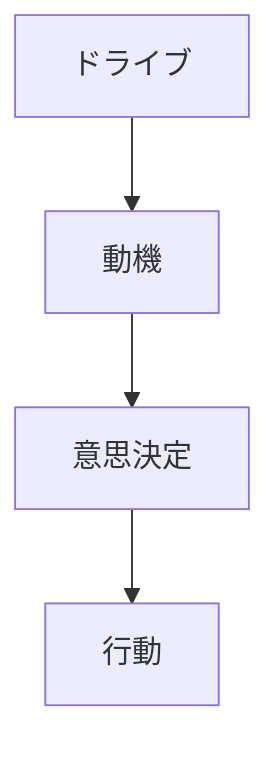
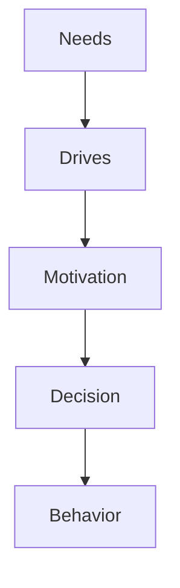

# Motivation Types

## 定義

動機（Motivation）とは、人間の行動を方向づけ、維持する心理的過程である。
動機は、
- 行動を開始させる
- 行動の方向を決める
- 行動の持続を支える
という役割を持つ。

---

## 基本構造

動機は次のプロセスで行動に影響する。

動機は「なぜその行動をするのか」を説明する。

---

## 動機の主要分類

心理学では動機をいくつかのタイプに分類する。

---

## 1 内発的動機（Intrinsic Motivation）

行動そのものが報酬になる動機。

例
- 学習の楽しさ
- 創作
- 探索
- 好奇心

特徴
- 持続性が高い
- 創造性が高い

---

## 2 外発的動機（Extrinsic Motivation）

外部報酬による動機。

例
- 報酬
- 賞
- 昇進
- 評価

特徴
- 即効性がある
- 持続性は低い場合がある

---

## 3 達成動機（Achievement Motivation）

目標達成を目指す動機。

例
- 成績
- 成功
- 能力証明

達成動機が強い人は
- 努力
- 挑戦
- 競争
を好む。

---

## 4 権力動機（Power Motivation）

他者への影響力を求める動機。

例
- リーダーシップ
- 支配
- 組織内影響

---

## 5 所属動機（Affiliation Motivation）

人間関係を求める動機。

例
- 仲間
- 集団
- 友情

社会的行動の重要な要因。

---

## 動機の特徴

動機には次の性質がある。

### 方向性

行動の方向を決める。

---

### 強度

行動の努力量を決める。

---

### 持続性

行動をどれだけ続けるかを決める。

---

## 動機と人格

人格はどの動機が強いかで特徴づけられる。

例
達成動機が強い人
- 競争志向
- 努力志向

所属動機が強い人
- 協調志向
- 社会志向

---

## 動機と環境

動機は環境によって変化する。

例

- 報酬制度
- 社会評価
- 文化

---

## 人格OSとの関係

人格OSでは

という因果関係で位置づけられる。
動機は、欲求を具体的な行動方向へ変換する仕組みである。

---

## 関連ノート

[[needs theory]]
[[drives]]
[[intrinsic extrinsic motivation]]
[[自己効用感]]
[[自己調整]]