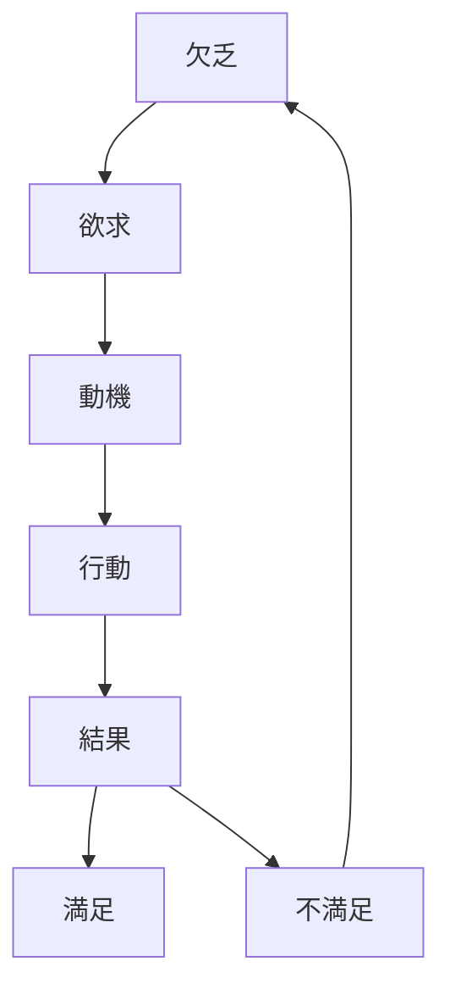
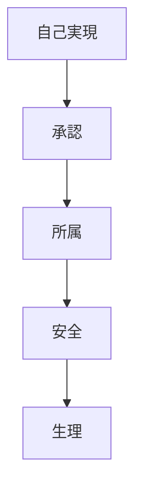
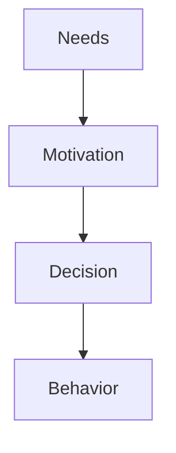

# Needs Theory

## 定義

欲求理論（Needs Theory）とは、人間の行動を[[基本的欲求]]の充足を目指す過程として説明する心理学理論である。
欲求とは、「不足している状態を解消しようとする心理的エネルギー」であり、行動・動機・意思決定の根源となる。

---

## 基本構造

欲求は次の行動連鎖を生む。

欲求が満たされると動機は一時的に弱まる。

---

## 欲求の主要分類

心理学では欲求をいくつかのタイプに分類する。

### 生理的欲求

生存に関わる欲求。

例
- 食事
- 睡眠
- 安全

---

### 社会的欲求

他者との関係に関わる欲求。

例
- 所属
- 愛情
- 承認

---

### 成長欲求

自己発展に関わる欲求。

例
- 知識
- 創造
- 自己実現

---

## マズローの欲求階層

最も有名な欲求理論。

下位欲求が満たされるほど上位欲求が現れやすくなる。

---

## 自己決定理論（Self-Determination Theory）

現代心理学で重要な理論。
人間には次の3基本欲求がある。
- 自律性（Autonomy）
- 有能感（Competence）
- 関係性（Relatedness）

これらが満たされると  
内発的動機が強まる。

---

## 欲求と人格

人格は欲求の優先順位に影響される。

例
達成欲求が強い人
- 競争志向
- 努力志向

所属欲求が強い人
- 協調志向
- 社会志向

---

## 欲求と社会

欲求は文化によっても変わる。

例
個人主義社会
- 自己実現

集団主義社会
- 所属
- 調和

---

## 欲求の歪み

欲求は次の要因で歪む。
- 社会比較
- 広告
- 習慣
- トラウマ

結果、偽の欲求が形成されることもある。

---

## 欲求と行動

人格OSでは次の位置になる。

欲求は行動エネルギーの源である。

---

## 関連ノート

[[02_zettelkasten/Zettelkasten Engine/02_knowledge/world_model/model/human/意思決定]]
[[drives]]
[[motivation types]]
[[intrinsic extrinsic motivation]]
[[自己調整]]