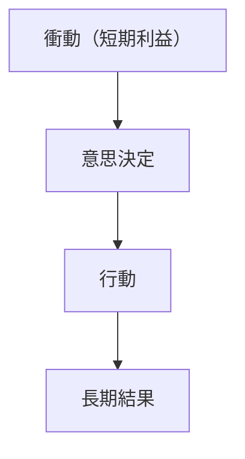
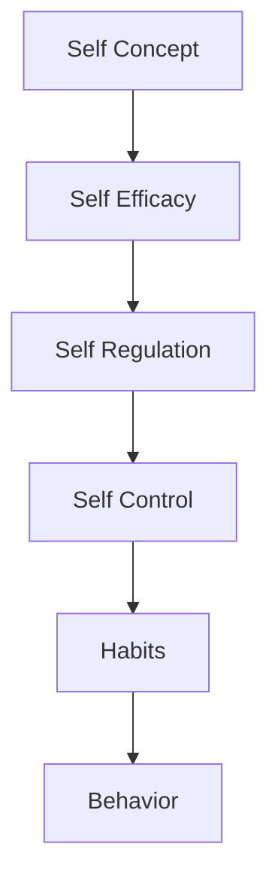

# Self Control

## 定義

自己制御（Self Control）とは、短期的な衝動や欲求を抑え、  長期的な目標に沿った行動を選択する能力である。

自己制御は、
- 衝動
- 欲求
- 感情
を調整することで目標達成を可能にする。

---

## 基本構造

自己制御は次の葛藤の中で働く。

自己制御は、長期目標が短期欲求を上回るように行動を調整する。

---

## 自己制御の役割

自己制御は次の行動に関係する。
- 勉強の継続
- 健康管理
- 金銭管理
- 衝動買いの抑制
- 感情の抑制

---

## 自己制御の心理構造

自己制御は次の要素から構成される。

### 衝動抑制

即時反応を抑える能力。

例
- 怒りの抑制
- 誘惑の回避
### 目標維持

長期目標を維持する能力。

例
- 勉強継続
- 訓練継続
### 注意制御

注意を目標に集中させる能力。

例
- 集中
- 誘惑回避

---

## 自己制御と遅延報酬

自己制御研究では、有名な マシュマロ実験 がある。
子供に
- 今すぐ1個食べる
- 待てば2個
という選択をさせる。

結果、待てた子供は
- 学業
- 健康
- 社会成功
で高い傾向を示した。

---

## 自己制御と意志力

自己制御は、意志力（willpower）と関係する。
意志力は、有限資源として働くという説がある。

例
- 疲労
- ストレス
で低下する。

---

## 自己制御の強化方法

心理学研究では次の方法が有効。

### 環境設計

誘惑を減らす。

例
- スマホを遠ざける
- 食べ物を置かない
### 事前コミットメント

将来の行動を先に決める。

例
- 契約
- 予定固定
### 習慣化

自動化により衝動対立を減らす。
### 小さな成功

成功体験で自己制御能力を強化。
## 自己制御と人格

人格研究では、誠実性（Conscientiousness）が自己制御と強く関係する。

---

## 自己制御と行動

人格OSでは次の位置になる。

自己制御は

**衝動と目標の衝突を解決する機構**

である。

---

## 関連ノート

[[自己調整]]
[[自己効用感]]
[[habit system]]
[[decision styles]]
[[motivation types]]