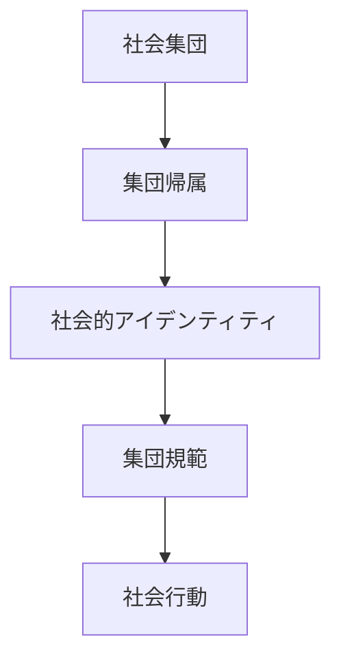
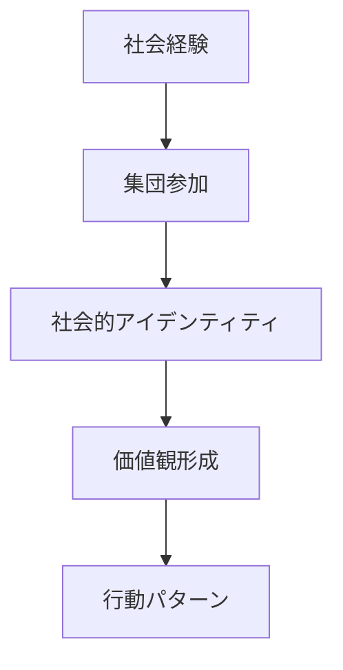
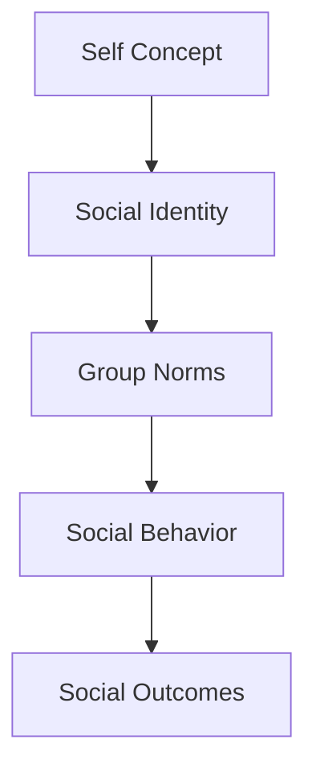

# Social Identity

## 定義

社会的アイデンティティ（Social Identity）とは、個人が自分をどの社会集団の一員として認識するかに関する自己概念である。
人間は、
- 個人としての自己
- 集団の一員としての自己
の両方を持つ。

---

## 基本構造

社会集団への帰属が、行動や価値観に影響する。

---
## 社会的アイデンティティ理論

心理学者 Henri Tajfel によって提唱された。
基本仮定：
人間は
- 自分の所属集団を高く評価し    
- 他集団との差異を強調する    
傾向がある。

---

## 社会的アイデンティティの構成要素

### 集団帰属

自分がどの集団に属するか。

例
- 国籍    
- 職業    
- 会社    
- 趣味コミュニティ    

---

### 集団価値

その集団の価値観。

例
- 規範    
- 文化    
- 行動様式    

---

### 集団比較

他集団との比較。

例
- 優越    
- 競争    
- 対立    

---

## 内集団と外集団

社会心理学では
- 内集団（Ingroup）：自分の集団  
- 外集団（Outgroup）：他の集団
が区別される。

---

## 内集団バイアス

人は
- 内集団を優遇    
- 外集団を過小評価    
する傾向がある。

例
- 仲間優先    
- 身内びいき    

---

## 社会的アイデンティティの形成

社会経験を通じて自分の社会的位置を理解する。

---

## 社会的アイデンティティの機能

### 自己理解

自分の位置を理解する。

---

### 行動指針

集団規範が行動を決める。

---

### 社会的連帯

仲間意識を生む。

---

### 集団競争

他集団との競争を生む。

---

## 社会的アイデンティティと人格

人格は
- どの集団に属するか    
- 集団価値をどう内面化するか    

によって変化する。

例
学者コミュニティ
- 知識重視    
- 論理志向    

軍組織
- 規律    
- 階層    

---

## 社会的アイデンティティと対人関係

社会的アイデンティティは、
- 協力    
- 対立    
- 信頼    
などの社会行動に影響する。

---

## 人格OSとの関係

社会的アイデンティティは、人格OSの社会行動レイヤーを形成する。

---

## 関連ノート

[[自己概念]]
[[attachment style]]
[[cooperation behavior]]
[[status behavior]]
[[人格特性]]]