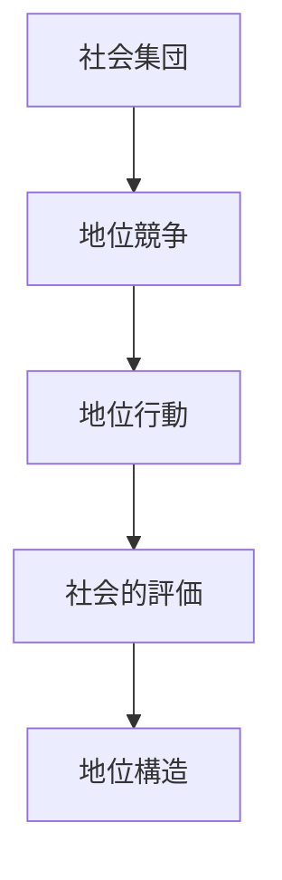
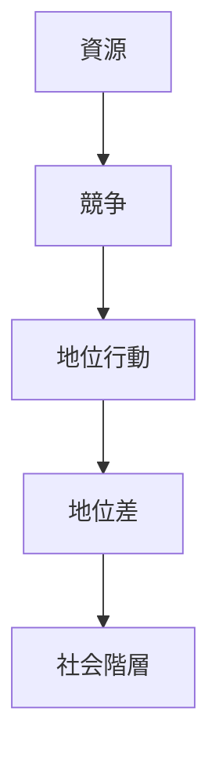
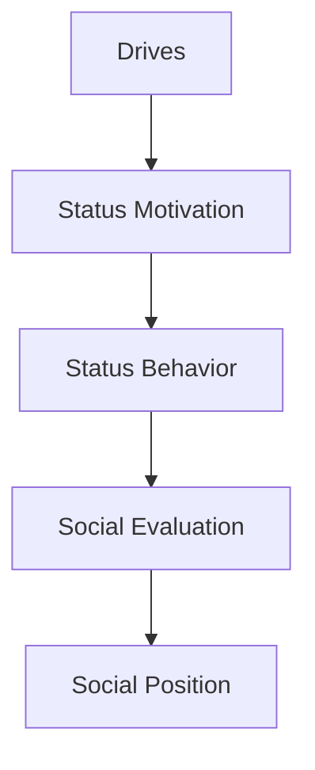

# Status Behavior

## 定義

地位行動（Status Behavior）とは、個人が社会集団の中で地位・影響力・尊敬を獲得または維持しようとする行動パターンである。
人間は社会的動物であり、多くの行動は地位競争または地位維持として説明できる。

---

## 基本構造

社会集団は、自然に地位階層を形成する。

---

## 地位の二つの獲得戦略

社会心理学では、地位獲得には2つの主要戦略がある。

---

### 支配戦略（Dominance）

力・威圧・権力による地位獲得。

特徴
- 攻撃性    
- 強制力    
- 恐怖による支配    

例
- 軍事権力    
- 暴力的支配    
- 威圧的リーダー    

---

### 威信戦略（Prestige）

能力・尊敬による地位獲得。

特徴
- 知識    
- 技能    
- 社会貢献    

例
- 学者    
- 熟練職人    
- 尊敬されるリーダー    

---

## 地位信号

人は様々な方法で地位を示す。

### 物質的信号

例
- 財産    
- 服装    
- 住居    

---

### 能力信号

例
- 知識    
- 技能    
- 成果    

---

### 社会信号

例
- 人脈    
- 影響力    
- 役職    

---

## 地位と人格特性

人格特性は地位行動に影響する。

例
外向性
- 社会的活動    
- リーダー行動    

誠実性
- 信頼    
- 長期評価    

協調性
- 協力    
- 集団安定    

---

## 地位と社会構造

社会は地位階層を形成する。

例
- 組織階層    
- 経済階層    
- 名声階層    

地位は、
- 資源  
- 影響力  
- 評価
と結びつく。

---

## 地位と進化心理学

進化心理学では、地位は重要な適応要因とされる。

理由
- 資源アクセス    
- 配偶機会    
- 集団影響力    

---

## 地位と競争

地位は競争を生む。

---
## 地位と協力

地位は協力にも影響する。

高地位者
- 影響力    
- 調整能力    

低地位者
- 服従    
- 協力    

---

## 人格OSとの関係

地位行動は  
人格OSの **社会競争モジュール**として働く。

---

## 関連ノート

[[social identity]]
[[cooperation behavior]]
[[人格特性]]
[[decision styles]]
[[drives]]