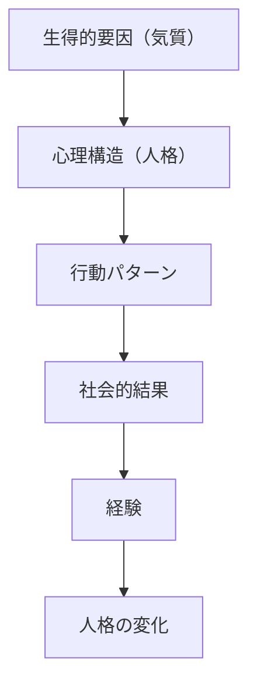
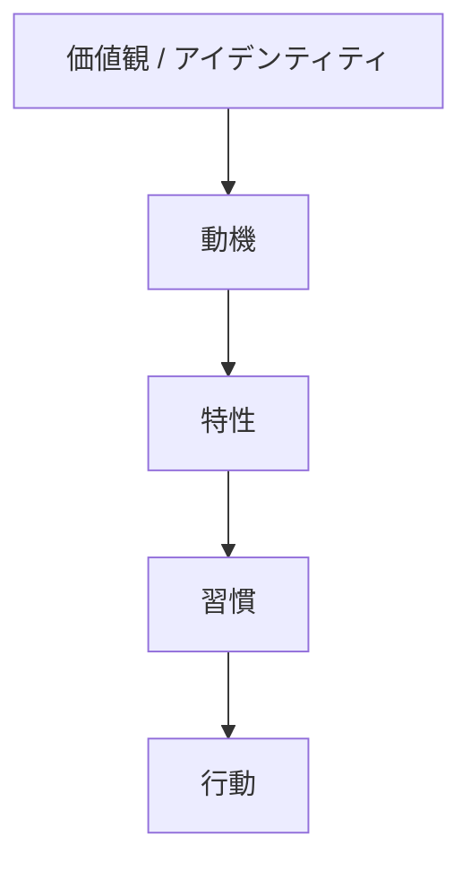
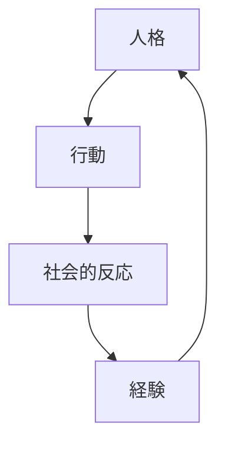

# Personality Model

## 定義

人格（Personality）とは、個人の思考・感情・行動のパターンを生み出す比較的安定した心理構造である。

人格は

- 認知
- 動機
- 感情
- 行動
- 社会関係

の相互作用によって形成される。

---

## 人格モデルの基本構造

人格は次の構造で理解できる。

人格は固定ではなく  
経験によって徐々に変化する。

---

## 人格の構成要素

人格は主に次の要素から構成される。

### 気質（Temperament）

生得的な心理傾向

例

- 情動反応性
- 外向性
- 刺激感受性

---

### 特性（Traits）

比較的安定した行動傾向

例

- 外向性
- 誠実性
- 神経症傾向

---

### 動機（Motivation）

人を行動させる欲求

例

- 達成欲求
- 所属欲求
- 権力欲求

---

### 認知（Cognition）

世界の理解方法

例

- 信念
- 解釈
- 思考パターン

---

### 感情（Emotion）

行動を調整する心理システム

例

- 喜び
- 怒り
- 恐れ
- 悲しみ

---

### 習慣（Habits）

繰り返される行動パターン

人格は習慣として外部に現れる。

---

## 人格の階層構造

人格は階層構造を持つ。

上位ほど

- 抽象度が高い
- 変化が遅い

---

## 代表的な人格モデル

心理学では様々な人格モデルが提案されている。

### 特性理論

人格は特性の集合である。

例

- Big Five

---

### 精神分析理論

人格は無意識構造から生まれる。

例

- フロイト

---

### 社会認知理論

人格は

- 認知
- 環境
- 行動

の相互作用。

---

### 発達理論

人格は人生段階で発達する。

例

- エリクソン

---

## 人格の形成要因

人格は次の要因で形成される。

### 遺伝

生物学的要因

---

### 環境

- 家庭
- 文化
- 教育

---

### 経験

- 成功
- 失敗
- 人間関係

---

### 社会

- 地位
- 集団
- 役割

---

## 人格のダイナミクス

人格は次の循環で変化する。

---

## 人格モデルの目的

人格モデルは次を理解するために使われる。

- 行動の予測
- 個人差の理解
- 社会関係の分析
- 自己理解

---

## 関連ノート

[[人格特性]]
[[気質]]
[[motivation types]]
[[emotion types]]
[[habit system]]
[[decision styles]]