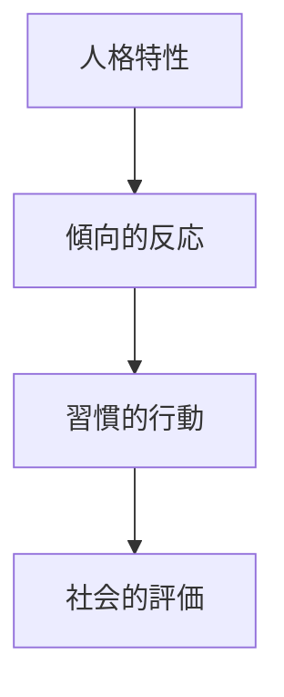
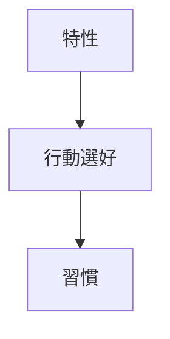

# Personality Traits

## 定義

人格特性（Personality Traits）とは、個人の思考・感情・行動に一貫した傾向を生み出す
比較的安定した心理的特徴である。

特性は

- 状況が変わっても比較的安定して現れる
- 行動の予測に使える

という特徴を持つ。

---

## 特性の基本構造

人格特性は次の構造で行動に現れる。

---

## 特性の特徴

人格特性には次の性質がある。

### 安定性

特性は短期間では変化しにくい。

---

### 個人差

人によって強さが異なる。

---

### 連続性

特性は「ある / ない」ではなく、弱い-強いの連続的尺度で表される。

---

### 状況依存性

特性は状況によって現れ方が変わる。

例

内向的な人でも  
専門分野では積極的になる。

---

## 特性と人格の関係

人格は複数の特性の組み合わせで構成される。

例  
- 外向性
- 誠実性  
- 協調性  
- 情緒安定性  
- 開放性

---

## 代表的特性理論

### Big Five

現代心理学で最も広く使われるモデル。
- O 開放性 
- C 誠実性  
- E 外向性  
- A 協調性  
- N 神経症傾向

---

### 気質理論

生得的特性を重視。

例

- 刺激感受性
- 情動反応

---

### 動機特性

行動の動機に関わる特性。

例

- 達成欲求
- 権力欲求
- 所属欲求

---

## 特性と習慣

人格特性は習慣として現れる。

---

## 特性と意思決定

人格特性は意思決定に影響する。

例

外向性

- リスク許容度が高い

誠実性

- 長期志向

神経症傾向

- 不安回避

---

## 特性の形成要因

人格特性は次の要因で形成される。

### 遺伝

約30〜50%は遺伝の影響。

---

### 環境

- 家庭
- 教育
- 社会

---

### 経験

- 成功
- 失敗
- 人間関係

---

## 特性の変化

人格特性は

- 完全固定ではない
- 長期的に変化する

特に変化しやすいのは

- 誠実性
- 情緒安定性

---

## 特性研究の目的

人格特性研究は次を目的とする。

- 行動予測
- 職業適性
- 社会関係理解
- 自己理解

---

## 関連ノート

[[人格モデル]]
[[ビッグファイブモデル]]
[[気質]]
[[habit system]]
[[decision styles]]