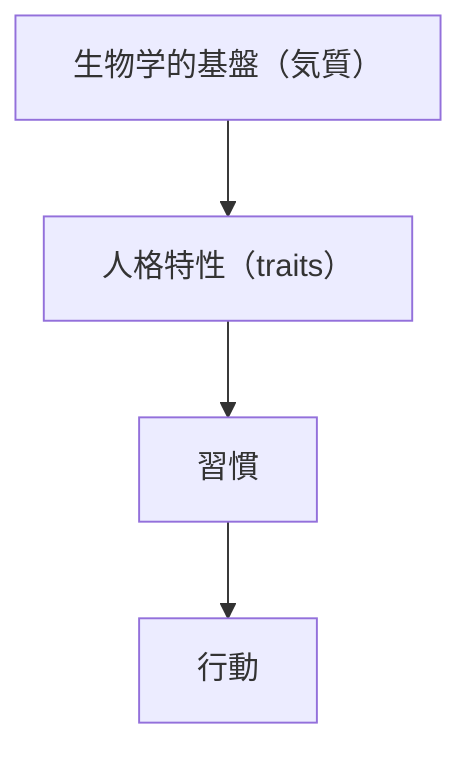

# Temperament

## 定義

気質（Temperament）とは、生得的な神経系の特性に基づく  感情反応・行動反応の基本的傾向である。
気質は、
- 生まれつきの要因が強い
- 幼児期から観察できる
- 人格特性の基盤となる

---

## 気質と人格の関係

人格形成は次の構造を持つ。

気質は  
人格の「土台」として機能する。

---

## 気質の特徴

### 生得性

気質は遺伝的要因が強い。

双生児研究では  
約40〜60%が遺伝の影響とされる。

---

### 早期出現

乳児期から観察可能。

例

- 活動性
- 情動反応
- 刺激感受性

---

### 長期安定性

完全固定ではないが  
長期的に安定する傾向がある。

---

## 代表的気質モデル

### トーマス＆チェスの気質理論

9つの気質次元を提案。

例

- 活動レベル
- 規則性
- 接近 / 回避
- 適応性
- 情緒強度

---

### 3タイプ分類

乳児の気質は次の3タイプに分類される。

#### Easy Child（扱いやすい）

- 安定
- 社交的
- 適応的

---

#### Difficult Child（扱いにくい）

- 情緒反応が強い
- 不規則
- 環境適応が遅い

---

#### Slow-to-Warm-up

- 慎重
- 新環境にゆっくり適応

---

### 生物学的気質モデル（Gray）

神経システムに基づくモデル。
- BIS（Behavioral Inhibition System：回避システム）
- BAS（Behavioral Activation System：接近システム）

---

## 気質の主要次元

気質研究では次の次元がよく使われる。

### 情動反応性

刺激に対する感情反応の強さ。

---

### 活動水準

行動エネルギーの高さ。

---

### 社会性

他者との関係志向。

---

### 注意制御

集中能力。

---

### 刺激感受性

刺激への敏感さ。

---

## 気質とBig Five

気質は人格特性の基盤となる。

例

| 気質 | Big Five |
|-----|---------|
| 社会性 | 外向性 |
| 情動反応 | 神経症傾向 |
| 注意制御 | 誠実性 |

---

## 気質と環境

人格形成は、気質 × 環境で決まる。
これを適合度（goodness of fit）という。

---

## 気質と適応

同じ気質でも環境によって結果が変わる。

例
慎重な気質
- 研究者 → 強み
- 営業 → 弱み

---

## 人格OSとの関係

人格OSでは、
1. Temperament
2. Traits  
3. Habits  
4. Behavior
という基盤になる。

---

## 関連ノート

[[人格モデル]]
[[人格特性]]
[[ビッグファイブモデル]]
[[emotion types]]
[[habit system]]
