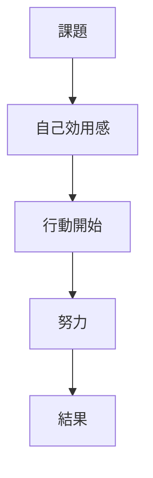
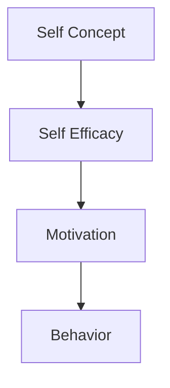

# Self Efficacy

## 定義

自己効力感（Self Efficacy）とは、「自分はこの課題を成功させることができる」という能力に対する主観的信念である。
この概念は心理学者Albert Banduraによって提唱された。
自己効力感は
- 行動開始
- 努力量
- 持続力
- 失敗後の回復
に強く影響する。

---

## 基本構造

自己効力感は行動の次の段階に影響する。

自己効力感が低いと
- 行動しない
- 途中で諦める
可能性が高くなる。

---

## 自己効力感の機能

自己効力感は次の心理機能を持つ。

### 行動開始

「できる」と思うほど人は行動を開始する。

---

### 努力量

自己効力感が高いほど努力量が増える。

---

### 持続性

困難に直面しても挑戦を続ける。

---

### 感情調整

自己効力感が高い人は
- 不安が少ない
- ストレス耐性が高い

---

## 自己効力感の形成要因

Banduraは  
自己効力感の形成要因を4つ挙げている。

### 1 成功経験

最も強い要因。
成功体験は自己効力感を強化する。

---

### 2 代理経験

他者の成功を見ること。

例
- ロールモデル
- 同僚の成功

---

### 3 社会的説得

他者からの励まし。

例
- 教師
- 上司
- 仲間

---

### 4 生理的状態

身体・感情状態。

例
- 緊張
- 疲労
- 不安

---

## 自己効力感と成果

研究では自己効力感は次の領域に影響する。
- 学習成果
- 職業成功
- スポーツ
- 健康行動

---

## 自己効力感と動機

自己効力感は動機と相互作用する。
1. 欲求  
2. 自己効力感  
3. 行動

欲求が強くても  
自己効力感が低いと行動しない。

---

## 自己効力感と人格

人格OSでは次の位置になる。

自己概念「自分は研究者だ」
↓
自己効力感「研究はできる」
↓
研究行動

---

## 自己効力感の向上方法

心理学研究では次の方法が有効とされる。

### 小さな成功

段階的成功体験。

---

### モデル観察

成功している他者を見る。

---

### フィードバック

具体的評価。

---

### スキル習得

能力向上。

---

## 自己効力感の限界

自己効力感は重要だが  
万能ではない。

理由

- 能力不足
- 外部制約
- 環境

があるため。

---

## 関連ノート

[[自己概念]]
[[自己調整]]
[[motivation types]]
[[habit system]]
[[decision styles]]
