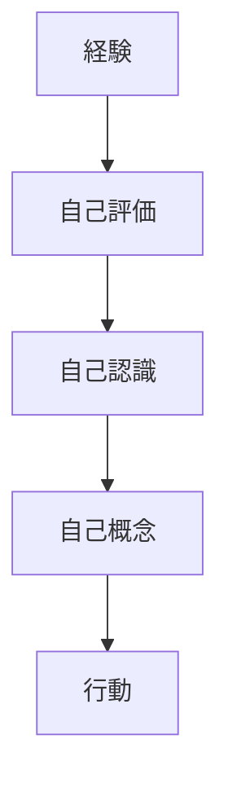
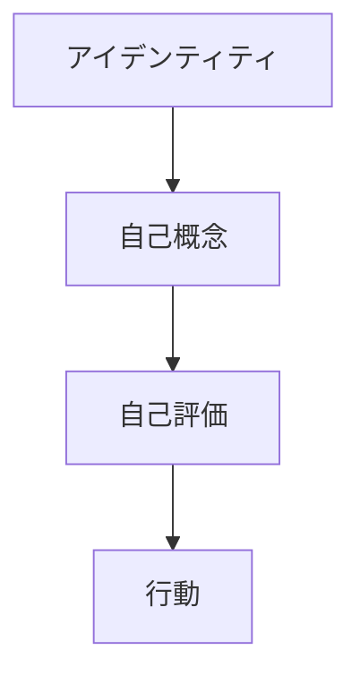
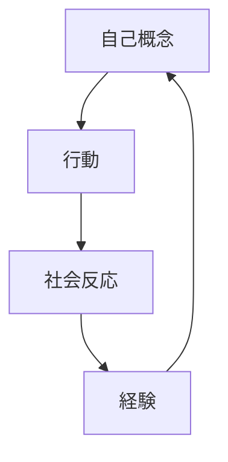

# Self Concept

## 定義

自己概念（Self Concept）とは、「自分は何者であるか」に関する認知的な自己理解の体系である。

自己概念は、
- 能力
- 役割
- 性格
- 社会的地位
- 価値観
などの認識から構成される。

---

## 基本構造

自己概念は次の構造を持つ。

自己概念は行動の方向を決定する。

---

## 自己概念の構成要素

### 能力認識

自分の能力についての理解。

例
- 知的能力
- 社会能力
- 身体能力

---

### 性格認識

自分の性格についての理解。

例
- 外向的
- 慎重
- 理論志向

---

### 社会的役割

社会における自分の役割。

例
- 学生
- 親
- 経営者
- 研究者

---

### 社会的地位

社会の中での位置。

例
- 職業
- 経済状況
- 集団内の位置

---

### 価値観

何を重要と考えるか。

例
- 成長
- 安定
- 自由
- 貢献

---

## 自己概念の階層

自己概念は階層構造を持つ。

アイデンティティは  
自己概念の中心に位置する。

---

## 自己概念の特徴

### 相対性

自己概念は他者との比較で形成される。

例
- 社会比較
- 評価

---

### 可変性

自己概念は経験によって変化する。

---

### 一貫性志向

人間は、「自分らしさ」を維持しようとする。

---

## 自己概念と行動

人は、自己概念から期待される行動を想定し、実際の行動
という形で行動する。

例

自分を「研究者」と認識

↓

- 読書
- 分析
- 議論

---

## 自己概念の形成要因

自己概念は次の要因で形成される。

### 社会的評価

他者からの評価。

---

### 経験

成功 / 失敗。

---

### 文化

社会の価値観。

---

### 社会的役割

職業・立場。

---

## 自己概念の歪み

自己概念は歪むことがある。

例
- 過小評価
- 過大評価
- 固定化

---

## 自己概念と人格

人格形成は次の循環を持つ。

という中間層になる。
自己概念は、人格の行動化を決定する層である。

---

## 関連ノート

[[人格モデル]]
[[identity structure]]
[[自己効用感]]
[[自己調整]]
[[social identity]]