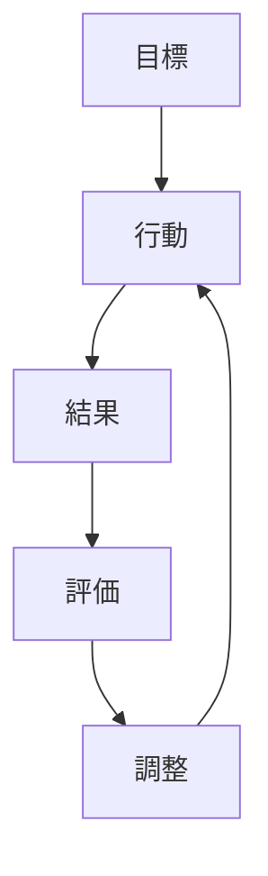
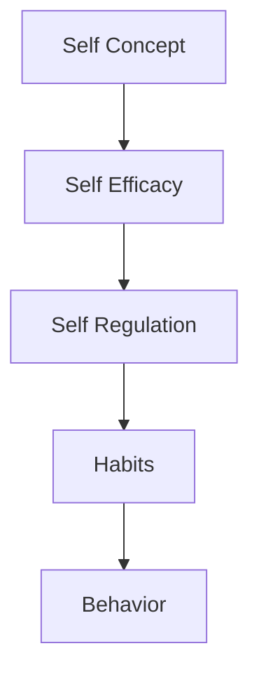

# Self Regulation

## 定義

自己調整（Self Regulation）とは、自分の行動・感情・思考を目標に合わせて調整する心理的プロセスである。
自己調整は
- 目標設定
- 行動監視
- 修正
の循環によって行われる。

---

## 基本構造

自己調整は次のサイクルを持つ。

この循環は、フィードバックループとして機能する。

---

## 自己調整の主要要素

### 1 目標設定

望ましい状態を定義する。

例
- 学習目標
- 健康目標
- キャリア目標

---

### 2 行動監視

自分の行動を観察する。

例
- 進捗確認
- 習慣追跡
- 日誌

---

### 3 評価

結果を目標と比較する。
現状と目標の差を認識する。

---

### 4 行動修正

差を縮めるため行動を調整する。

例
- 努力増加
- 方法変更
- 目標変更

---

## 自己調整と感情

自己調整は感情にも関係する。

例
- 怒りの抑制
- 不安の調整
- 衝動の制御

---

## 自己調整と動機

自己調整は動機と連動する。
1. 欲求  
2. 目標  
3. 自己調整  
4. 行動

動機が強いほど  
自己調整は維持されやすい。

---

## 自己調整と習慣

自己調整は習慣形成と密接に関係する。
- 初期段階：自己調整→意識的行動
- 習慣化後：自動行動

となり  
自己調整の負担が減る。

---

## 自己調整の限界

自己調整には限界がある。

原因

- 意志力の消耗
- ストレス
- 疲労
- 環境誘惑

---

## 自己調整を強化する方法

研究では次が有効とされる。

### 環境設計

誘惑を減らす。
### 小目標

達成可能な目標設定。
### フィードバック

進捗確認。
### 習慣化

自動化による負担軽減。

---

## 人格OSとの関係

人格OSでは次の位置になる。

自己調整は  
**人格を行動に変換する制御機構**である。

---

## 関連ノート

[[自己概念]]
[[自己効用感]]
[[self control]]
[[habit system]]
[[motivation types]]