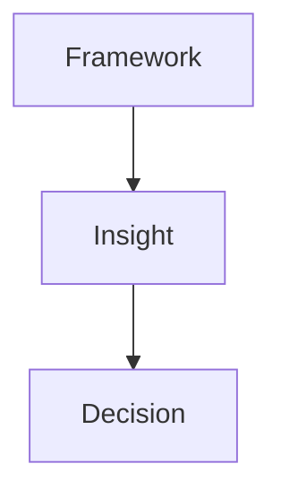
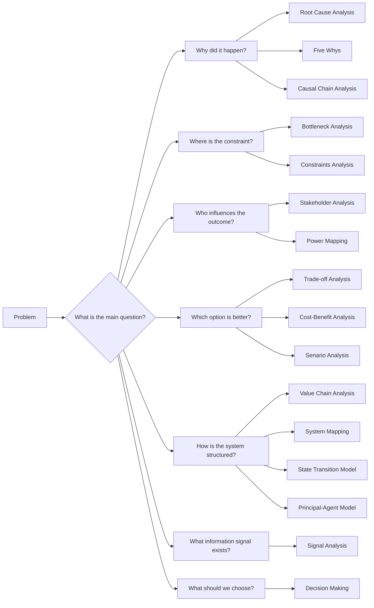
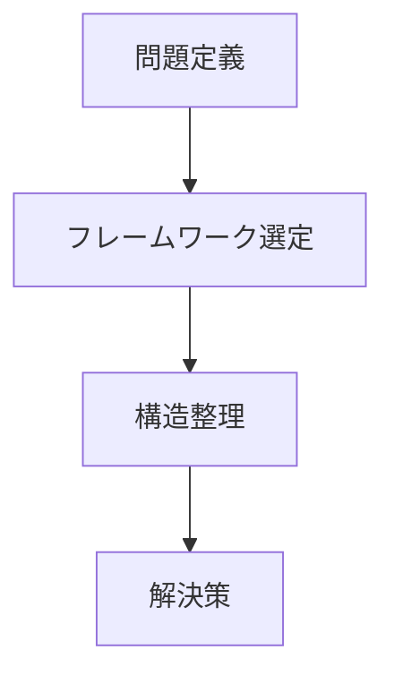
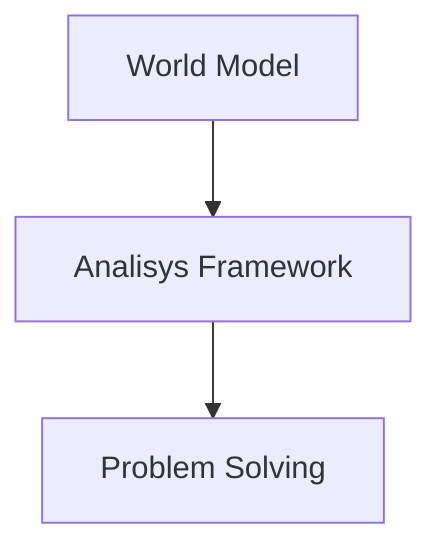

# 概要  
Analysis Frameworkは、問題や現象を分析するための思考の型（framework）である。  
現実の複雑な事象を、分解・構造化・因果分析するための思考ツール群。
Frameworkは、World Model を問題分析に適用する橋渡しになる。
# 分析の基本フロー

# 効果
- 見落としを防ぐ  
- 構造を明確化する  
- 思考を再利用できる
# フレームワーク一覧
## 因果分析  
原因を特定するフレーム  
- [[02_zettelkasten/Zettelkasten Engine/02_process/methods/analysis/根因分析|根因分析]] （根本原因分析）
- [[02_zettelkasten/Zettelkasten Engine/02_process/methods/analysis/なぜなぜ分析|なぜなぜ分析]]（なぜなぜ分析）
- [[02_zettelkasten/Zettelkasten Engine/02_process/methods/analysis/因果連鎖分析|因果連鎖分析]]    （因果連鎖分析）
## 制約分析  
システムの制約を特定する  
- [[02_zettelkasten/Zettelkasten Engine/02_process/methods/analysis/ボトルネック分析|ボトルネック分析]]]（ボトルネック分析）
- [[02_zettelkasten/Zettelkasten Engine/02_process/methods/analysis/制約分析|制約分析]] （制約分析）
## 利害・権力分析  
利害関係者の構造  
- [[02_zettelkasten/Zettelkasten Engine/02_process/methods/analysis/ステークホルダー分析|ステークホルダー分析]] （ステークホルダー分析）
- [[02_zettelkasten/Zettelkasten Engine/02_process/methods/analysis/パワーマッピング|パワーマッピング]]  （パワーマッピング）
- [[02_zettelkasten/Zettelkasten Engine/02_process/methods/analysis/インセンティブ設計|インセンティブ設計]]
## トレードオフ分析  
複数目標のバランス  
- [[02_zettelkasten/Zettelkasten Engine/02_process/methods/analysis/トレードオフ分析|トレードオフ分析]] （トレードオフ分析）
- [[02_zettelkasten/Zettelkasten Engine/02_process/methods/analysis/費用便益分析|費用便益分析]]  （費用便益分析）
## 構造分析  
対象の構造理解  
- [[world model Hub]]
- [[02_zettelkasten/Zettelkasten Engine/02_process/methods/analysis/価値連鎖分析|価値連鎖分析]] 
- [[02_zettelkasten/Zettelkasten Engine/02_process/methods/analysis/システムマッピング|システムマッピング]]（システムマッピング）
- [[02_zettelkasten/Zettelkasten Engine/02_process/methods/analysis/状態遷移モデル|状態遷移モデル]]（状態遷移モデル）
## 情報分析
- [[02_zettelkasten/Zettelkasten Engine/02_process/methods/analysis/代理人問題|代理人問題]]
- [[02_zettelkasten/Zettelkasten Engine/02_process/methods/analysis/信号分析|信号分析]]
## 不確実性分析
- [[02_zettelkasten/Zettelkasten Engine/02_process/methods/analysis/インセンティブ設計]]
- [[02_zettelkasten/Zettelkasten Engine/02_process/methods/analysis/シナリオ分析|シナリオ分析]]
## 意思決定分析
- [[02_zettelkasten/Zettelkasten Engine/02_process/methods/analysis/意思決定フレームワーク|意思決定フレームワーク]]
# 選び方
問題の種類によって使い分ける  

# 使用の基本  

# 特徴
