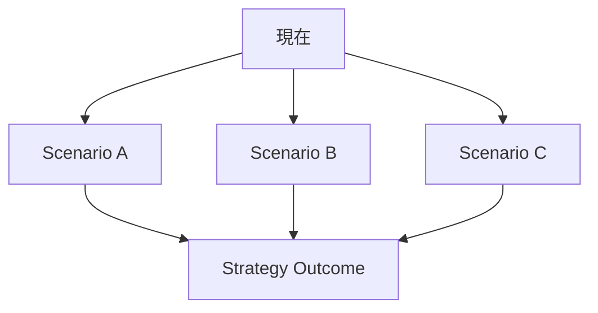
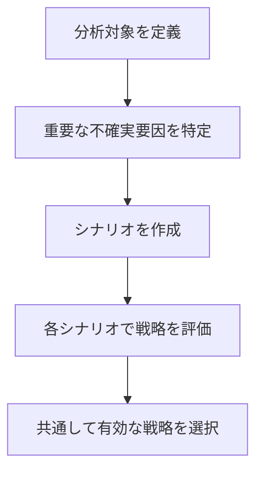

# 概要

Scenario Analysisは、将来の不確実性を考慮し、  
複数の可能な未来（シナリオ）を設定して戦略を評価する分析フレームワークである。

現実の意思決定では未来は一つに決まっていないため、 単一の予測ではなく複数の可能性を比較する必要がある。
Scenario Analysisは次のような意思決定で使われる。

- 長期戦略  
- 政策設計  
- 投資判断  
- 不確実性の高い環境

---

# Scenarioの基本構造

意思決定では、複数の未来と各未来での結果を比較する。

---

# 手順

---

# シナリオの典型例

## 市場

- 市場成長    
- 市場停滞    
- 市場縮小

## 技術

- 技術革新    
- 技術停滞    
## 制度

- 規制強化    
- 規制緩和

---

# 分析のポイント

Scenario Analysisでは次の点を確認する。

## 不確実性

どの変数が未来を分岐させるか

## ロバスト性

どの戦略が複数の未来で有効か

## リスク

特定シナリオで致命的損失がないか

---

# 重要性

未来は予測できないが、  未来の範囲を想定することはできる。
Scenario Analysisは、予測ではなく準備のための分析である。

---

# 適用例

### 例：観光業
- 外国人観光客増加  
- 外国人観光客減少  
- 国内観光中心

### 例：交通業
- 需要増加  
- 需要横ばい  
- 需要減少

---

# 関連ノート

