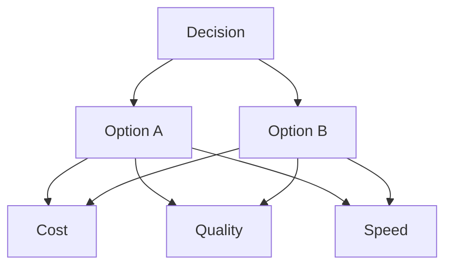
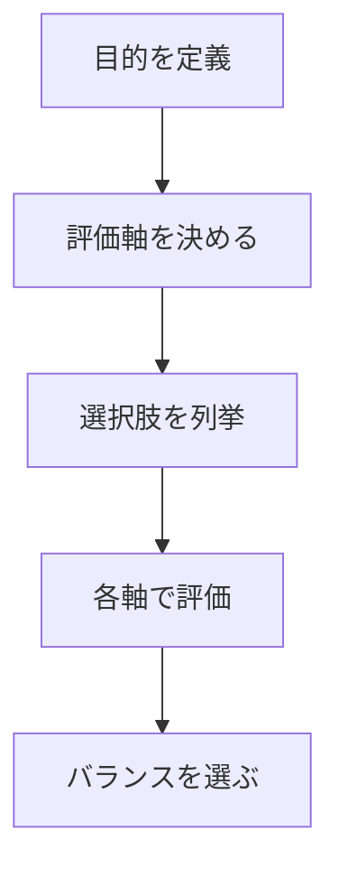

# 概要

Tradeoff Analysisは、複数の目標が同時に最大化できない場合に、最適なバランスを決定する分析フレームワークである。
多くの意思決定は、最適解ではなく複数の価値のバランスを選ぶ問題である。
# Tradeoffの基本構造

意思決定ではすべての評価軸を同時に最大化できない。
# 手順

# 重要性
多くの失敗は、Tradeoffを無視することで起きる。
- すべてを最大化しようとする
- 制約を認識しない
# # 関連ノート
- [[old_zettelkasten/domain/domain_template 2/method/analysis/ステークホルダー分析]]
- [[02_zettelkasten/domain/domain_template 2/method/analysis/ボトルネック分析]]
- [[decision framework]]