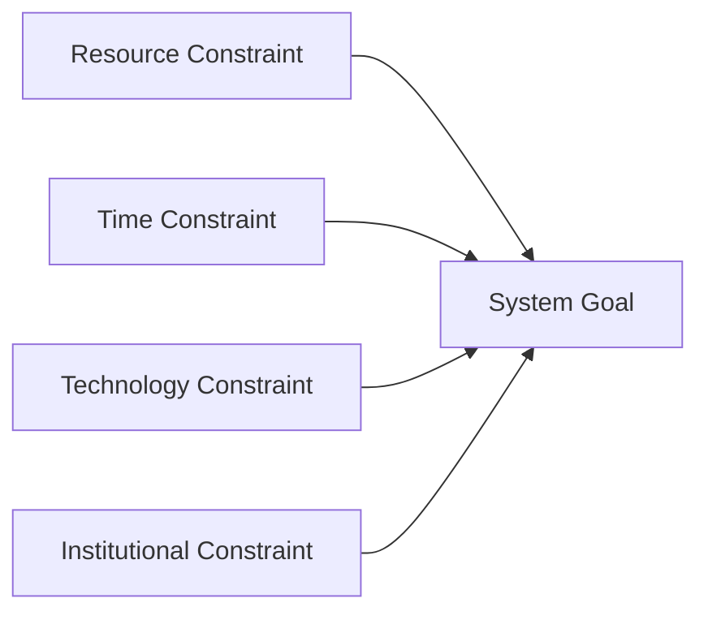
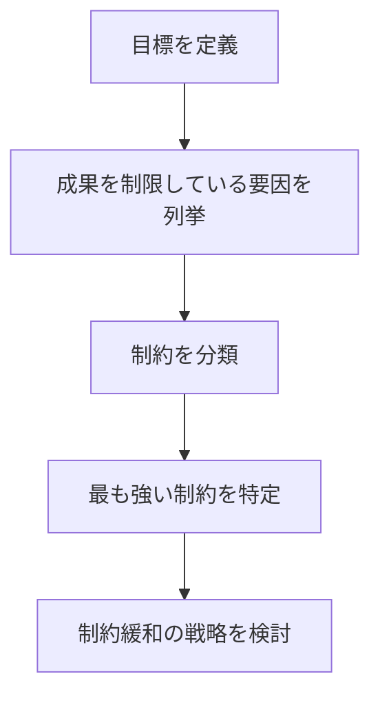

# 概要

Constraints Analysisは、システムや組織の成果を制限している制約条件（constraints）を特定する分析フレームワークである。
多くの問題は、能力不足ではなくシステムの制約によってパフォーマンスが制限されることで発生する。
Constraints Analysisは
- 何が成果を制限しているのか
- どの制約が最も強いのか
- 制約をどう緩和できるのか
を明らかにする。

---

# Constraintsの基本構造

システムの成果は、最も強い制約によって決まる。

---

# 手順

---
# 制約の典型分類

## 資源制約

- 人員    
- 資金    
- 設備

## 時間制約

- 納期    
- 生産時間    
- 移動時間    

## 技術制約

- 技術水準    
- インフラ    

## 制度制約

- 法規制    
- 組織ルール    

## 情報制約

- 情報不足    
- 認知限界

---

# 分析のポイント

Constraints Analysisでは次を確認する。

## 支配制約

どの制約が成果を最も制限しているか

## 制約の位置

システムのどこに制約が存在するか

## 制約の可変性

制約は短期で変えられるか

---

# 典型例

### 例：企業

売上 = 生産能力 × 販売能力

制約
- 工場能力    
- 販売網    
- 資金

### 例：交通業

輸送能力 = 車両 × 運転手 × 時間

制約
- 車両数    
- 運転手    
- 運行時間    

---

# 他フレームとの関係

| フレーム                        | 役割        |
| --------------------------- | --------- |
| [[02_zettelkasten/domain/domain_template 2/method/analysis/ボトルネック分析]] | 局所制約      |
| [[02_zettelkasten/domain/domain_template 2/method/analysis/制約分析]] | システム全体の制約 |
| [[02_zettelkasten/domain/domain_template 2/method/analysis/価値連鎖分析]] | 活動構造      |
| [[02_zettelkasten/domain/domain_template 2/method/analysis/感度分析]] | 重要変数      |

---

# 重要性

多くの問題は努力不足ではなく、制約の誤認によって起きる。
Constraints Analysisはどこが限界なのかを明確にする。

---

# 関連ノート

- [[02_zettelkasten/domain/domain_template 2/method/analysis/ボトルネック分析]]    
- [[02_zettelkasten/domain/domain_template 2/method/analysis/価値連鎖分析]]    
- [[02_zettelkasten/domain/domain_template 2/method/analysis/シナリオ分析]]   
- [[02_zettelkasten/domain/domain_template 2/method/analysis/00 Analysis Framework Hub]]