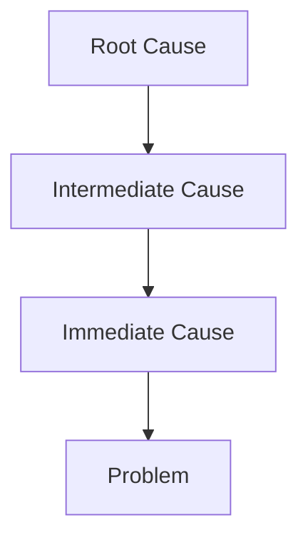
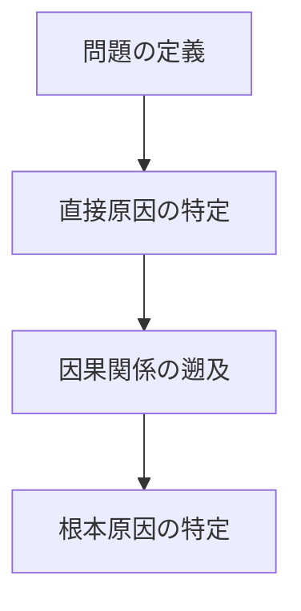

# 概要
根本原因分析（RCA）は、問題の表面的原因ではなく、根本原因を特定する分析手法である。  
多くの問題は、
- 症状  
- 中間原因  
- 根本原因   
の階層構造を持つ。  
RCAの目的は、再発を防ぐ原因を特定することである。
# 基本構造

# 典型的な誤り
多くの人は、Immediate Cause（直接原因）で分析を止めてしまう。しかし、これは真因ではない。
# 手順

# 用途
- 業務改善  
- システム障害  
- 組織問題  
- 事故分析