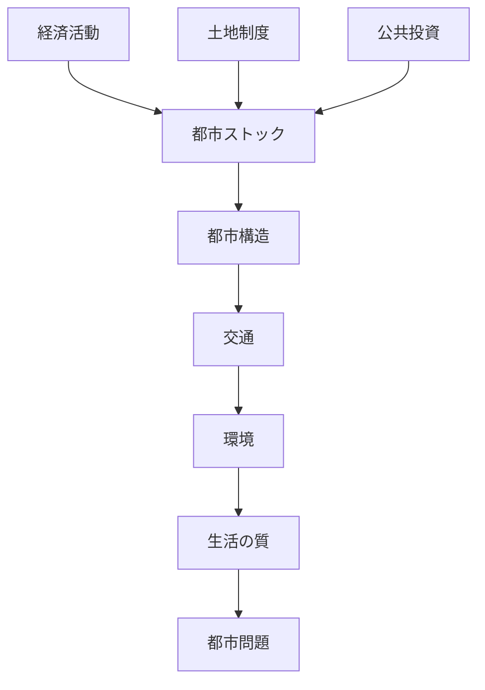
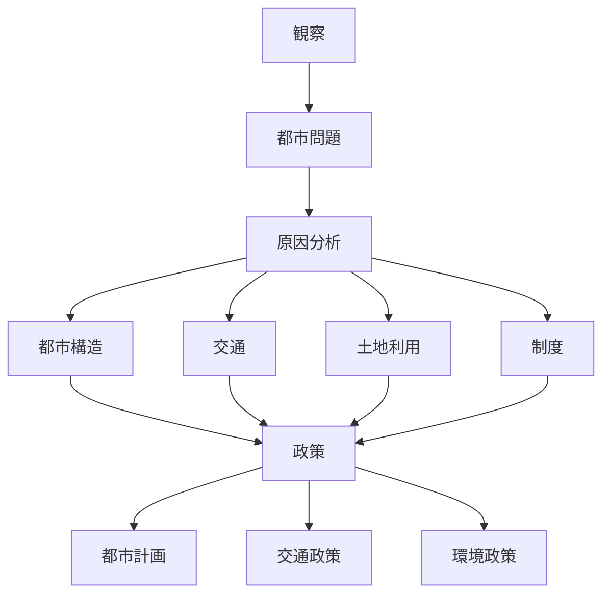

# 空間計画 Problem Structure

空間計画の問題は

都市構造  
↓  
交通  
↓  
環境  
↓  
生活

の関係から発生する。

---

# 問題の基本構造

---

# 典型的都市問題

## スプロール

原因

- 土地規制弱い
- 自動車依存
- 郊外住宅

結果

- 移動距離増加
- インフラ維持費増大
- 環境負荷増大

---

## 渋滞

原因

- 道路容量不足
- 自動車依存
- 都市集中

結果

- 移動時間増加
- 経済損失

---

## インフラ老朽化

原因

- ストック蓄積
- 更新投資不足
- 人口減少

結果

- 維持費増大
- 事故リスク

---

## 環境問題

原因

- 自動車交通
- 郊外化
- エネルギー消費

結果

- CO₂排出
- 大気汚染

---

# 問題分析フレーム

---

# 空間計画の政策解決

## 都市構造

- コンパクトシティ
- 都市集約

---

## 交通

- 公共交通
- LRT
- モビリティマネジメント

---

## 土地

- 都市計画
- ゾーニング
- 区画整理

---

## 環境

- 持続可能交通
- エネルギー政策

---

# 接続ノード

## Kernel

- [[外部性]]
- [[02_zettelkasten/Zettelkasten Engine/01_knowledge/world_model/academic/principles/集積の経済]]
- [[ストック経済]]

---

## World Model

- [[空間計画 OS]]

---

## Domain

- [[空間計画論 Hub]]

---

# 自分のメモ

（ここに分析を書く）