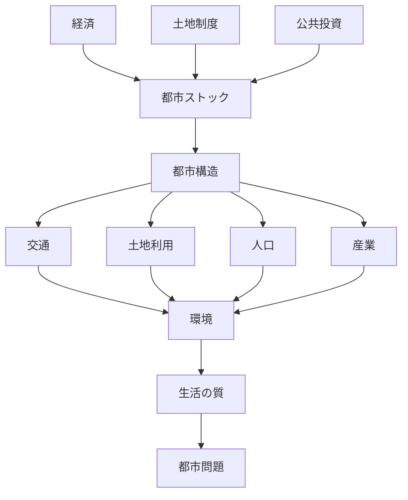
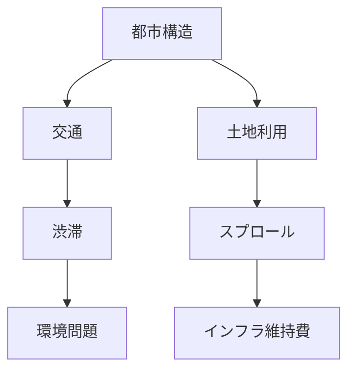
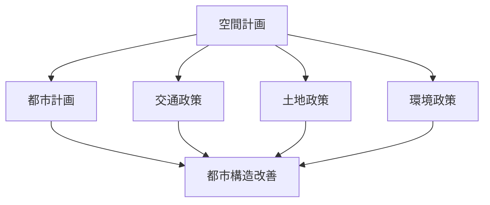
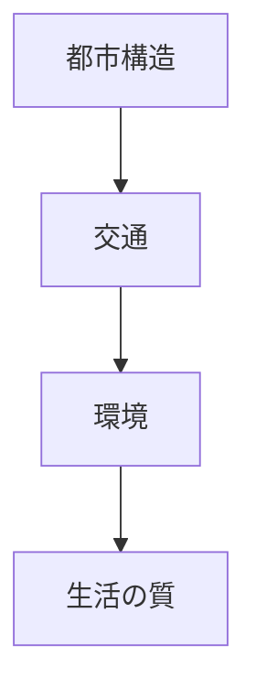

# 都市システムモデル（空間計画）

都市は

経済  
土地制度  
公共投資  

によって形成された

**都市ストック**

を基盤として成立する。

その結果として

都市構造  
交通  
環境  
生活の質  

が決まる。

---

# 都市システム（統合モデル）

---

# 都市問題の発生

都市問題は

都市構造  
交通  
土地利用  

から生まれる。

---

# 空間計画の政策介入

空間計画は都市構造に介入する政策である。

---

# 空間計画の政策目標

## 持続可能都市

- 環境負荷削減
- エネルギー効率
- 都市集約

---

## コンパクトシティ

- 都市機能集中
- 公共交通中心
- 移動距離短縮

---

## 都市ストック管理

- インフラ更新
- 都市再開発
- 空き家対策

---

# 都市システムの本質

都市問題の多くは

**都市構造の問題**

である。

---

# 接続ノード

## Hub

[[空間計画論 Hub]]

---

## OS

[[空間計画 OS]]

---

## Problem

[[空間計画 Problem Structure]]

---

# 自分のメモ

（ここに都市分析を書く）