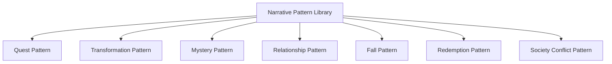

# Narrative Pattern Library

Narrative Pattern Library は、物語の典型構造を分類し蓄積する知識庫である。

目的は次の3つである。

1. 作品の型を理解する  
2. 異なる作品の構造比較を可能にする  
3. 創作時の設計パターンとして利用する  

物語は完全な自由形式ではなく、  
多くの場合いくつかの**反復される構造パターン**に属する。

---

# 構造

---

# 主な物語パターン

## Quest Pattern（探索型）

主人公が目的達成のために進む物語。

特徴

- 明確な目標
- 障害の連続
- 進行型構造

典型例

- 冒険
- 旅
- 救出
- 任務

例

- 指輪物語
- ドラゴンボール
- 多くのRPG物語

---

## Transformation Pattern（変容型）

主人公の内面変化が中心の物語。

特徴

- 欠落
- 誤解
- 成長

例

- 成長物語
- 青春物語
- 多くのヒューマンドラマ

---

## Mystery Pattern（謎解き型）

真相解明が中心の物語。

特徴

- 情報差
- 誤導
- 真相開示

例

- 探偵物
- サスペンス
- 推理

---

## Relationship Pattern（関係型）

人物関係の変化が中心の物語。

特徴

- 感情
- 誤解
- 和解

例

- 恋愛
- 家族
- 友情

---

## Fall Pattern（転落型）

主人公の破滅へ向かう物語。

特徴

- 欠点
- 誤判断
- 崩壊

例

- 悲劇
- 権力転落
- 犯罪物

---

## Redemption Pattern（救済型）

罪や失敗からの回復の物語。

特徴

- 罪
- 後悔
- 贖罪

例

- 贖罪物語
- 再生物語

---

## Society Conflict Pattern（社会対立型）

個人と社会の対立を描く物語。

特徴

- 制度
- 権力
- 抵抗

例

- ディストピア
- 政治ドラマ
- 革命物

---

# パターン分析テンプレート

作品：

---

## 主パターン

どの型に属するか

---

## 副パターン

複合パターンの場合

---

## パターン特徴

作品固有の要素

---

## 構造との関係

13フェイズ構造との接続を書く

---

# 注意

ほとんどの作品は

**単一パターンではなく複合型**

である。

例

- Quest + Relationship
- Mystery + Transformation
- Fall + Society

---

# まとめ

Narrative Pattern Library は

**物語の型を分類し、比較可能にする構造**

である。

これにより

- 作品理解
- 作品比較
- 創作設計

が可能になる。