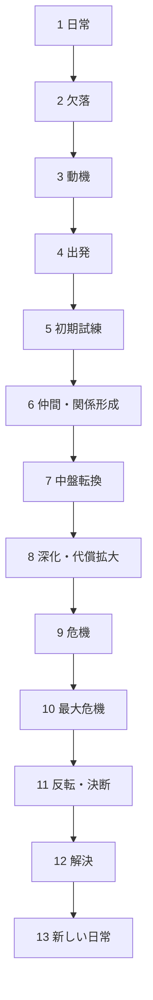

# 13 Phase Structure

13 Phase Structure は、小説・アニメ・漫画・ドラマ・映画などの物語を、主人公の変化とドラマの推進過程に沿って13段階で読むための鑑賞構造である。  
ベースは沼田やすひろの13フェイズ構造とし、本ノートでは**鑑賞OSで使える分析用の標準形**として整理する。

この構造の目的は、単なる感想ではなく、

- 物語がどこで動いたのか
- 主人公が何を失い、何を求め、どう変わったのか
- どの局面で観客の感情が動員されたのか
- 何が強く、何が弱かったのか

を、再利用可能な形で把握することである。

---

# 要点

13フェイズ構造は、単なる出来事の順番ではない。  
本質は次の3点にある。

1. **欠落から始まり、変化した日常へ戻ること**
2. **中盤転換と最大危機を中心にドラマが再編されること**
3. **主人公の外的行動と内的変化を並行して読むこと**

したがって、鑑賞時には「事件が起きたか」だけでなく、

- 主人公の欲求
- 主人公の恐れ
- 関係性の変化
- テーマの提示と回収
- 日常の意味の変化

を一緒に追う必要がある。

---

# 全体構造

全体の読み方
13フェイズは大きく4区分で読むと分かりやすい。
I 導入部
1 日常
2 欠落
3 動機
ここでは「主人公は何者で、何が足りていないか」が置かれる。
面白さの核は、しばしばこの欠落の質にある。
II 展開部
4 出発
5 初期試練
6 仲間・関係形成
ここでは物語世界への進入と、関係線・ルール・対立の立ち上げが起きる。
視聴者・読者はここで「この作品は何を見せる物語か」を掴む。
III 変調部
7 中盤転換
8 深化・代償拡大
9 危機
ここで物語は単純な前進ではなくなる。
中盤転換によって意味が変わり、代償が増し、選択が重くなる。
IV 収束部
10 最大危機
11 反転・決断
12 解決
13 新しい日常
ここで主人公は一度限界に達し、その後に真の選択を行い、変化した状態で世界に戻る。
終盤の良し悪しは、しばしば最大危機→決断→新しい日常の接続の強さで決まる。
各フェイズ
1 日常
定義
物語開始時点の平常状態。
主人公の立場、性格、環境、人間関係、価値観が示される。
役割
基準点を与える
後の変化を測るための比較対象を置く
欠落が何であるかを浮かび上がらせる
見るポイント
主人公はどんな生活をしているか
何に満足していて、何に鈍感か
周囲との関係は安定しているか、空虚か
この日常は本当に健全か、それとも仮初めか
弱い作品の典型
日常が薄く、後の変化が効かない
主人公の輪郭が見えない
欠落の前提が成立していない
2 欠落
定義
主人公の内面または状況にある不足・喪失・空白が顕在化する段階。
役割
物語の原動力を生む
主人公に未解決課題があることを示す
テーマの根を置く
欠落の種類
愛情の欠落
承認の欠落
居場所の欠落
自己理解の欠落
能力・資格・地位の欠落
喪失による空白
見るポイント
主人公は何を持っていないのか
その欠落を本人は自覚しているか
欠落は外的問題か、内的問題か
欠落が物語の最後でどう変質するか
重要
多くの作品では、主人公が最初に求めるものと、本当に必要なものは一致しない。
そのズレがドラマを生む。
3 動機
定義
主人公が動き始める理由が明確になる段階。
役割
行動の方向を与える
欠落を目的へ変換する
観客に「なぜこの物語が始まるのか」を納得させる
動機の形
誰かを助けたい
真相を知りたい
失ったものを取り戻したい
自分を変えたい
相手と関わりたい
逃げたい／守りたい
見るポイント
動機は十分に切実か
その動機は主人公らしいか
動機と欠落はどうつながっているか
動機が後で更新されるか
弱い作品の典型
動機が薄い
展開の都合でしか動かない
欠落との接続が弱い
4 出発
定義
主人公が日常圏から一歩踏み出し、物語の本筋へ入る段階。
役割
物語を本格始動させる
新しいルールや関係に入らせる
主人公に選択の責任を生じさせる
典型例
新しい学校・職場・街へ行く
ヒロイン／相棒／事件に本格的に関わる
調査・戦い・旅・恋愛に乗り出す
一線を越える決断をする
見るポイント
出発は自発か、半強制か
主人公は何を捨てて何に入るのか
出発によって何が後戻り不能になるのか
5 初期試練
定義
新しい状況に入った主人公が最初の壁にぶつかる段階。
役割
物語世界のルールを実感させる
主人公の未熟さを見せる
今後の課題を具体化する
見るポイント
最初の失敗は何か
主人公の弱点は何か
その試練は作品固有のルールを示しているか
試練が後半の大問題の予告になっているか
重要
初期試練は小さく見えて、終盤の危機の縮図になっていることが多い。
6 仲間・関係形成
定義
主人公と他者との関係線が形成・再編される段階。
役割
単独の問題を関係の問題へ拡張する
ドラマの感情密度を上げる
後の裏切り・喪失・救済の基盤を作る
関係の種類
仲間
師匠
恋愛相手
対立相手
鏡像人物
共同体
見るポイント
誰が主人公を動かしているか
誰との関係がテーマの担い手か
ここで築かれた関係が終盤でどう試されるか
会話・仕草・沈黙にどんな感情線があるか
重要
作品の「好き嫌い」は、このフェイズの出来に大きく左右される。
7 中盤転換
定義
物語の意味・目標・関係・真相のいずれかが大きく転換する段階。
役割
前半と後半を分ける
単純な直進を破る
観客に「これはそういう話だったのか」と思わせる
主人公の行動原理を更新する
中盤転換の典型
真相の一部が判明する
敵／味方の意味が変わる
恋愛や友情が質的に変化する
目的そのものが変わる
主人公の誤解が崩れる
見るポイント
何が転換したのか
それは出来事の転換か、意味の転換か
主人公の欲求はどう更新されたか
ここから先で物語の緊張はどう変質したか
重要
このフェイズが弱いと、物語は「前半の延長」のまま終わる。
8 深化・代償拡大
定義
中盤転換を受けて、関係・対立・選択のコストが深く重くなる段階。
役割
問題を一段深い層へ掘り下げる
主人公に代償を払わせる
終盤の危機へ向けて圧力を高める
見るポイント
何が以前より重くなったか
守るべきものは増えたか
失ったら痛い対象が定まったか
主人公の弱点が拡大再生産されていないか
重要
このフェイズでは、外的事件以上に感情的負債の増大を見るとよい。
9 危機
定義
主人公が明確な行き詰まりや損失に直面する段階。
役割
クライマックス前の緊張を高める
主人公の戦略や自己像の限界を露呈させる
最大危機の前段を作る
危機の典型
関係の破綻
作戦の失敗
誤解の暴発
大切なものの離反
目的達成の見込み喪失
見るポイント
危機は何によって生じたか
外部圧力か、主人公自身の未熟さか
中盤転換で生じた問題がどう表面化したか
ここで何をまだ誤解しているか
10 最大危機
定義
主人公が最も深く打ちのめされ、従来のやり方ではもう進めない地点。
役割
旧い自己の限界を確定する
真の変化を要請する
クライマックス前の最低点を作る
特徴
一番失いたくないものを失う／失いかける
自己否定に近い状態になる
外的にも内的にも袋小路になる
ここで初めてテーマが痛みとして立ち上がる
見るポイント
何が最大なのか
主人公は何を失ったか
何がもう通用しないと示されたか
観客はこの時点で何を願うようになるか
重要
最大危機は大事件である必要はない。
静かな決別、言葉にならない断絶、自己欺瞞の崩壊でもよい。
重要なのは、主人公の旧い在り方が破綻することである。
11 反転・決断
定義
最大危機を経て、主人公が新しい理解・覚悟・行動原理を得て立ち上がる段階。
役割
物語の主題を主人公が引き受ける
受動から能動へ移る
解決への道を開く
見るポイント
主人公は何を理解したのか
何を諦め、何を引き受けたのか
以前の自分と何が違うのか
反転は説得的か、急すぎないか
重要
本当に強い作品では、このフェイズが単なる逆転手ではなく、
内面の更新による反転になっている。
12 解決
定義
主要対立や中心課題が収束し、物語上の決着がつく段階。
役割
ドラマ上の問いに答えを出す
関係・事件・真相・目的に決着を与える
変化が現実の行動として示される
見るポイント
何が解決され、何が未解決のまま残るか
解決はテーマに即しているか
主人公の変化が具体的行動として見えるか
ご都合主義的処理になっていないか
注意
すべてを片づける必要はない。
しかし、作品が立てた主要な問いには答える必要がある。
13 新しい日常
定義
一連の出来事を経た後の、新しい平常状態。
役割
変化の定着を示す
物語の意味を静かに確定する
最初の日常との対比を完成させる
見るポイント
最初の日常と何が違うか
主人公の関係性はどう変わったか
欠落は埋まったのか、受容されたのか
テーマはどう余韻化されているか
重要
良い終わりは派手さよりも、変化の実感を残す。
13フェイズ構造は、1 日常と13 新しい日常の差分で読むと最もよく見える。
鑑賞OSでの実務的な使い方
1. まず場面をログ化する
視聴・読書中は、いきなり評価せず、まず場面を記録する。
Scene Log テンプレート
作品名
話数／章／尺
主要出来事
関与人物
印象的なセリフ
感情の動き
推定フェイズ
疑問点
2. その後に13フェイズへ配置する
全話視聴後、または章ごとに、場面を13フェイズへ割り振る。
見方
どこが日常か
どこで欠落が見えるか
どこで本当に出発したか
中盤転換はどこか
最大危機はどこか
新しい日常は何か
3. 主人公の変化線を取る
13フェイズは、主人公の変化と一緒に見ないと表面的になる。
追うべき項目
欲求
恐れ
誤解
関係
自己像
最終的な受容
4. テーマと接続する
物語の各フェイズが、最終的に何を語っているかを見る。
問い
この作品は何を失うことを恐れているか
何を得ることを救済として描くか
主人公の変化は何を肯定／否定しているか
作品評価に使う診断質問
構造診断
日常は十分に提示されているか
欠落は切実か
動機は納得できるか
出発は後戻り不能か
初期試練は作品のルールを示しているか
中盤転換は意味の更新になっているか
最大危機は旧い自己の破綻になっているか
決断は内面変化を伴っているか
新しい日常は最初との差分を見せているか
感情診断
どこで興味が強くなったか
どこで感情移入が起きたか
どこで緊張が落ちたか
どこで納得より違和感が勝ったか
終了後に何が余韻として残ったか
主題診断
この作品の欠落は何を象徴していたか
反転・決断で主人公は何を学んだか
解決はテーマと整合しているか
新しい日常は何を意味しているか
よくある失敗パターン
5. 欠落が弱い
最初に主人公が何を欠いているかが見えないため、全体が軽く見える。
6. 動機が薄い
主人公が物語の都合で動いているように見える。
7. 中盤転換がない
前半の延長で進むだけなので、後半に入っても新鮮味が出ない。
8. 最大危機が浅い
主人公が本当に壊れておらず、反転の説得力が落ちる。
9. 解決だけして変化していない
事件は片づいても、主人公の自己や関係が変わっていない。
10. 新しい日常が描かれない
余韻が弱く、作品の意味が定着しない。
この構造の強み
11. 媒体をまたいで使える
小説
アニメ
漫画
ドラマ
映画
いずれにも適用しやすい。
12. 感想を構造化できる
「なんとなく良かった」を、 「中盤転換が強く、最大危機が主人公の誤解崩壊として機能した」 のように言い換えられる。
13. 創作に転用できる
鑑賞だけでなく、プロット設計にも直結する。
限界
14. 全作品が綺麗に13分割できるわけではない
実験作、群像劇、非線形作品、雰囲気中心作品にはズレが出る。
15. 構造だけでは面白さを説明しきれない
演出、作画、演技、音楽、テンポ、文体、画面設計などの力も大きい。
16. 脇役主導作品では主人公だけ追うと不足する
複数人物の変化線を重ねて読む必要がある。
鑑賞OSでの推奨接続先
[[Story Analysis Hub]]
[[Scene Log Structure]]
[[Phase Mapping Structure]]
[[Character Arc Structure]]
[[Theme Extraction Structure]]
[[Emotional Curve Structure]]
[[Scene Function Structure]]
まとめ
13フェイズ構造とは、
欠落を抱えた主人公が、関係と試練を通じて一度壊れ、変化して新しい日常へ至る構造である。
鑑賞OSにおいて重要なのは、各フェイズを単に当てはめることではない。
重要なのは、
何が欠落だったか
どこで意味が変わったか
どこで主人公が壊れたか
何を引き受けて立ち上がったか
最後に何が変わったか
を抽出し、作品ごとの差異を比較可能にすることである。
この構造を使えば、鑑賞は「感想」から「分析」へ進み、さらに「創作可能な知識」へ変わる。