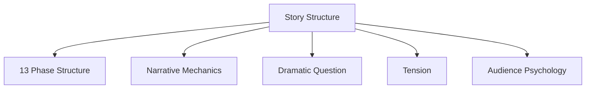
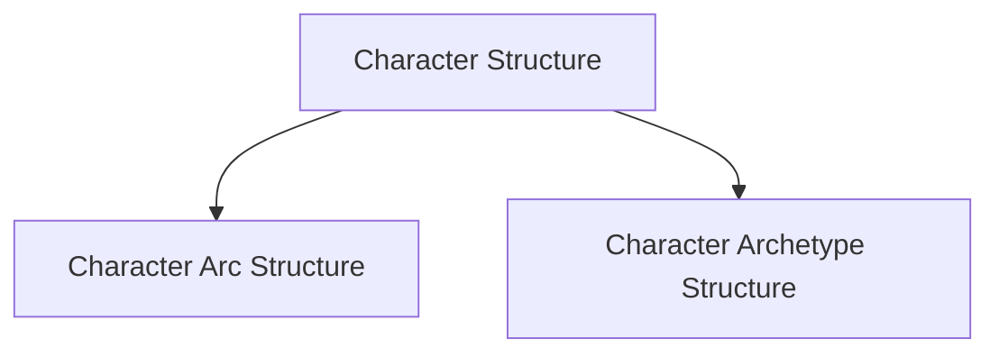
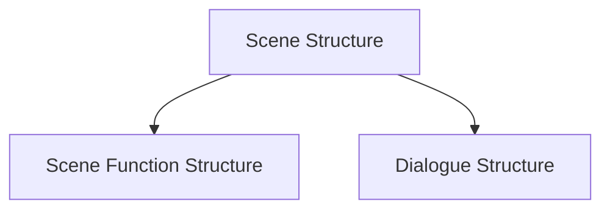
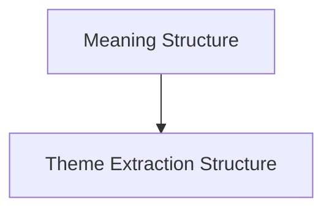
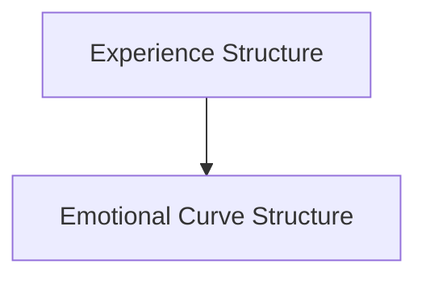
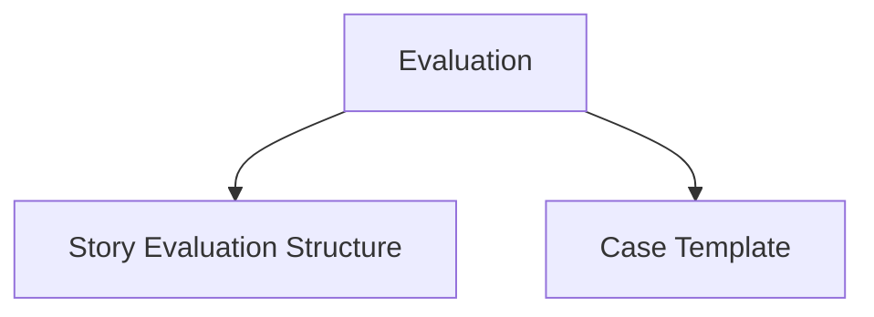
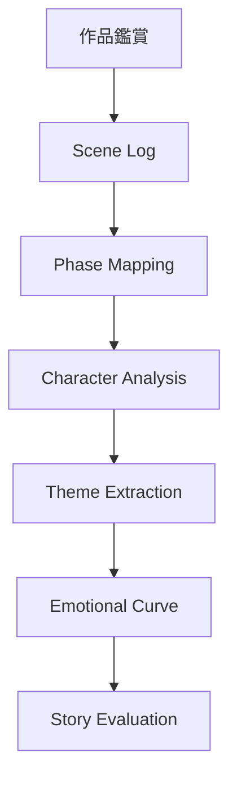
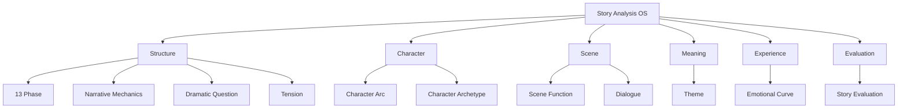

# Story Structure Hub

Story Structure Hub は、物語分析OSの中心ノードである。

目的は次の3つ。

1. 物語構造の全体像を把握する  
2. 各分析ノートを接続する  
3. 鑑賞・分析・創作を統合する  

このHubからすべての物語分析ノートへアクセスできる。

---

# 物語構造全体

---

# 人物構造

---

# シーン構造

---

# 意味構造

---

# 体験構造

---

# 評価構造

---

# 物語分析フロー

---

# 鑑賞OSの層構造

---

# 使用方法

作品を見るときの基本手順。

1  
Scene Log を取る

2  
Phase Mapping を作る

3  
Character Arc を分析

4  
Theme を抽出

5  
Emotional Curve を作る

6  
Story Evaluation を書く

---

# 分析の核心質問

- 主人公は何を欠いているか  
- 物語の中心質問は何か  
- どこで物語が転換するか  
- 最大危機はどこか  
- 主人公は何を理解したか  
- 最後に何が変わったか  

---

# まとめ

Story Structure Hub は

**物語分析OSの全ノートを統合する中心ノード**

である。

このHubを起点にすることで

- 鑑賞
- 分析
- 比較
- 創作

を体系的に行える。