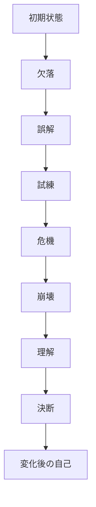

# Character Arc Structure

Character Arc は、主人公が何を誤解し、何を経験し、何を理解して変わったかを追うための構造である。

物語の本質は、出来事の列ではなく、人物の変化にある。

---

# 変化構造

---

# 基本発想

多くの物語では、主人公は最初に「誤った答え」を握っている。

その誤解が試練によって揺さぶられ、危機で破綻し、最後に新しい理解へ到達する。

---

# 分析テンプレート

## 1. 初期状態
主人公は最初どんな人物か。

- 性格
- 立場
- 人間関係
- 価値観
- 行動パターン

---

## 2. 欠落
主人公は何を持っていないか。

- 愛情
- 承認
- 居場所
- 自信
- 自己理解
- 能力
- 他者との接続

---

## 3. 誤解
主人公は世界、自分、他者をどう誤解しているか。

例:
- 一人でなければ価値がない
- 他人は信用できない
- 本音を出せば嫌われる
- 強くなければ生きられない

---

## 4. 試練
その誤解を揺らす試練は何か。

- 小さな失敗
- 対立
- 関係の変化
- 他者からの指摘
- 成功の代償

---

## 5. 危機
何が行き詰まるか。

- 作戦の失敗
- 関係の破綻
- 誤解の暴発
- 目標喪失
- 自己喪失

---

## 6. 崩壊
どこで旧い自己が通用しなくなるか。

ここが最大危機と接続する。

---

## 7. 理解
主人公は何を理解するか。

- 欠落を受け入れる
- 他者を必要と認める
- 誤解を捨てる
- 本当に求めていたものに気づく

---

## 8. 決断
何を選び取るか。

理解だけで終わらず、行動へ移る点が重要である。

---

## 9. 変化
最後に何が変わったか。

- 行動
- 言葉
- 関係
- 自己認識
- 世界の見え方

---

# 診断質問

- 主人公の欠落は明確か
- 誤解は物語全体を動かしているか
- 試練は誤解を揺さぶっているか
- 崩壊は十分深いか
- 理解は唐突でないか
- 決断は変化を行動として示しているか
- 最後に初期状態との差分が見えるか

---

# 注意点

- 変化しない主人公も存在する
- その場合は、主人公ではなく周囲が変化する構造かもしれない
- 群像劇では複数の Arc を並行して作る必要がある