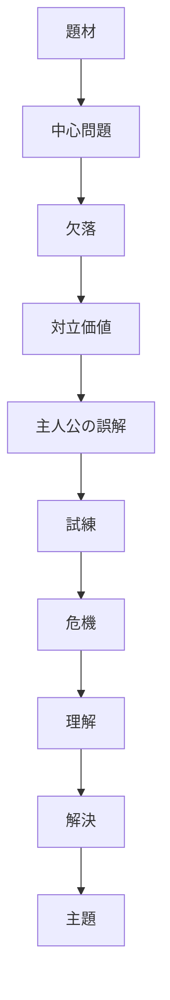

# Theme Extraction Structure

Theme Extraction は、その作品が最終的に**何を語っているか**を抽出する構造である。

ここでいう Theme とは、単なる話題ではない。  
恋愛、戦争、青春、友情のような題材名ではなく、

- 何が欠けていたのか
- 何が人を傷つけるのか
- 何が人を救うのか
- 主人公は何を誤解し、何を理解したのか

を通じて立ち上がる**価値判断・人間理解・世界理解**である。

---

# 基本構造

---

# 基本発想

テーマは、作者が直接説明した文ではなく、  
**物語の構造全体が最終的に示した答え**である。

したがって、テーマは次の材料から抽出する。

- 主人公の欠落
- 繰り返し出る対立
- 大事なセリフ
- 危機で露呈したもの
- 最後に肯定された選択
- 新しい日常で定着した価値

---

# テーマ抽出の手順

## 1. 題材を確認する
まず、その作品が何を扱っているかを把握する。

例:
- 恋愛
- 成長
- 家族
- 喪失
- 復讐
- 救済
- 社会対立
- 戦争
- 記憶
- アイデンティティ

ただし、題材はテーマそのものではない。

---

## 2. 中心問題を確認する
その作品で繰り返し問われている問題は何か。

例:
- 人は他者を信じられるか
- 過去を背負って生きられるか
- 正しさと優しさは両立するか
- 自己犠牲は救いか破滅か
- 幸せを受け取ることは許されるか

---

## 3. 欠落を確認する
主人公や主要人物は何を欠いているか。

テーマはしばしば、欠落をどう扱うかに現れる。

---

## 4. 対立価値を確認する
作品内で何と何がぶつかっているか。

例:
- 自立 / 依存
- 本音 / 建前
- 自己犠牲 / 自己保存
- 秩序 / 自由
- 記憶 / 忘却
- 個人 / 社会
- 愛 / 支配

テーマはしばしば、この対立に対する最終的態度として見える。

---

## 5. 主人公の誤解を確認する
主人公は最初、何を間違って信じているか。

ここが強いほど、テーマも明確になる。

---

## 6. 危機と理解を見る
最大危機で何が壊れ、どんな理解が生まれたかを見る。

テーマはこのあたりで一気に可視化される。

---

## 7. 最後に肯定されたものを見る
物語の最後に、

- 何が報われたか
- 何が否定されたか
- どんな関係が残ったか
- どんな態度が選ばれたか

を確認する。

ここからテーマを文章化する。

---

# テーマ抽出テンプレート

## 1. 題材
この作品が表面上扱っている主題領域は何か。

---

## 2. 中心問題
この作品が繰り返し問うている中心問題は何か。

---

## 3. 欠落
主人公または主要人物の欠落は何か。

---

## 4. 対立価値
作品内で対立している価値は何か。

- A:
- B:

---

## 5. 誤解
主人公は何を誤解しているか。

---

## 6. 危機
危機で何が露呈したか。

---

## 7. 理解
主人公は何を理解したか。

---

## 8. 最後に肯定されたもの
作品の最後に肯定された選択・関係・態度は何か。

---

## 9. テーマ候補
この作品が最終的に語っていることを一文で書く。

---

# テーマ記述の型

テーマは次のような形で書くと整理しやすい。

## 型1
「AではなくBである」

例:
- 強さとは、他者を拒絶することではなく、他者に頼れることである
- 償いとは、過去を消すことではなく、背負って生きることである

## 型2
「Aして初めてBできる」

例:
- 自分の弱さを認めて初めて、他者とつながれる
- 喪失を受け入れて初めて、新しい日常へ進める

## 型3
「AはBを生む / 破壊する」

例:
- 建前だけの優しさは、むしろ孤独を深める
- 自己犠牲の美化は、他者との相互性を壊す

## 型4
「AとBの対立に対し、この作品はCを選ぶ」

例:
- この作品は、自立と依存の対立に対し、相互依存を選ぶ
- この作品は、正義と愛情の対立に対し、関係の維持を優先する

---

# テーマ抽出の診断質問

- 題材とテーマを混同していないか
- 単なる教訓文になっていないか
- 主人公の変化とつながっているか
- 最大危機と接続しているか
- 結末で肯定されたものと整合しているか
- 作品全体を見て再現可能な表現になっているか

---

# よくある失敗

## 1. 題材をそのままテーマとする
「友情がテーマ」「恋愛がテーマ」では粗すぎる。

## 2. 自分の感想をそのまま載せる
テーマは自分の感動点ではなく、作品構造から抽出する。

## 3. 教訓にしすぎる
作品が本当にそこまで単純な結論を出しているとは限らない。

## 4. 多義性を潰しすぎる
良い作品ほど、テーマは一文で固定しきれず、複数の層を持つことがある。

---

# 補助観点

テーマを見るときは、次も有効である。

- 繰り返されるモチーフ
- 対比される人物
- 反復されるセリフ
- どの行動が報われ、どの行動が破綻したか
- 最後の静かな場面で何が残ったか

---

# まとめ

Theme Extraction とは、  
**欠落・対立・危機・理解・結末を通じて、作品が何を肯定し何を否定したかを抽出する構造**である。

題材を見るのではなく、  
**何が問題となり、何が壊れ、何が残ったか**を見ることで、テーマは明確になる。