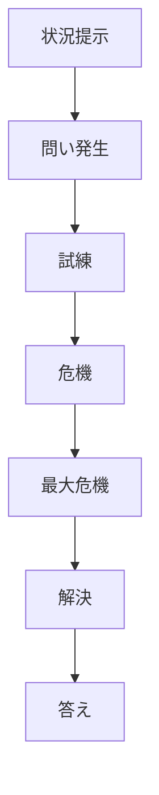
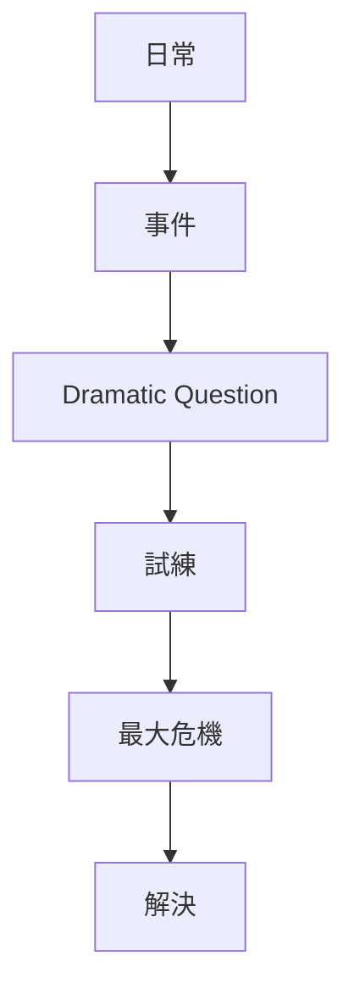
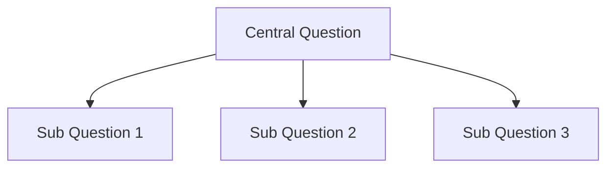

# Dramatic Question Structure

Dramatic Question は、物語の中心となる  
**「観客が答えを知りたくなる問い」**である。

物語は、この問いが提示され、  
最後に答えられることで成立する。

観客は次の理由で物語を見続ける。

- 答えを知りたい
- 結末を確認したい
- 人物の運命を見届けたい

この心理を生むのが Dramatic Question である。

---

# 基本構造

---

# Dramatic Question の種類

## Outcome Question（結果）

最も基本的な型。

例

- 主人公は勝つのか
- 二人は結ばれるのか
- 犯人は捕まるのか
- 任務は成功するのか

---

## Identity Question（正体）

人物の正体が問題になる型。

例

- 犯人は誰か
- この人物は何者か
- 本当の敵は誰か

---

## Moral Question（道徳）

人物の選択が問われる型。

例

- 主人公は正しい選択をするのか
- 復讐を選ぶのか赦すのか

---

## Relationship Question（関係）

人物関係の行方。

例

- 二人は理解し合えるのか
- 家族は和解できるのか

---

# Dramatic Question の位置

通常、問いは **序盤**で提示される。

---

# サブ質問

多くの作品には  
中心質問以外に

**Sub Dramatic Questions**

が存在する。

例

中心質問  
「主人公は世界を救えるのか」

サブ質問

- 仲間は生き残るのか
- ヒロインは救われるのか
- 主人公は自分を許せるのか

---

# 質問構造

---

# 分析テンプレート

作品：

---

## 中心質問

この物語の中心の問い。

---

## 質問提示シーン

どこで提示されたか。

---

## サブ質問

副次的な問い。

---

## 最大危機

問いが最も強くなる瞬間。

---

## 解決

問いの答え。

---

# 良い Dramatic Question

- 明確
- 切実
- 解決が気になる

---

# 弱い Dramatic Question

## 1 曖昧

何が問題なのか分からない。

---

## 2 小さい

答えに興味が持てない。

---

## 3 早く解決する

中盤で答えが出てしまう。

---

# まとめ

Dramatic Question は

**観客が物語を追い続ける理由を作る構造**

である。

この問いが強い