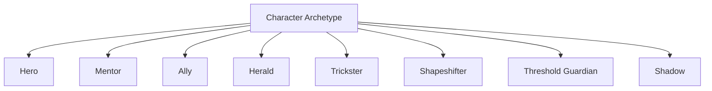
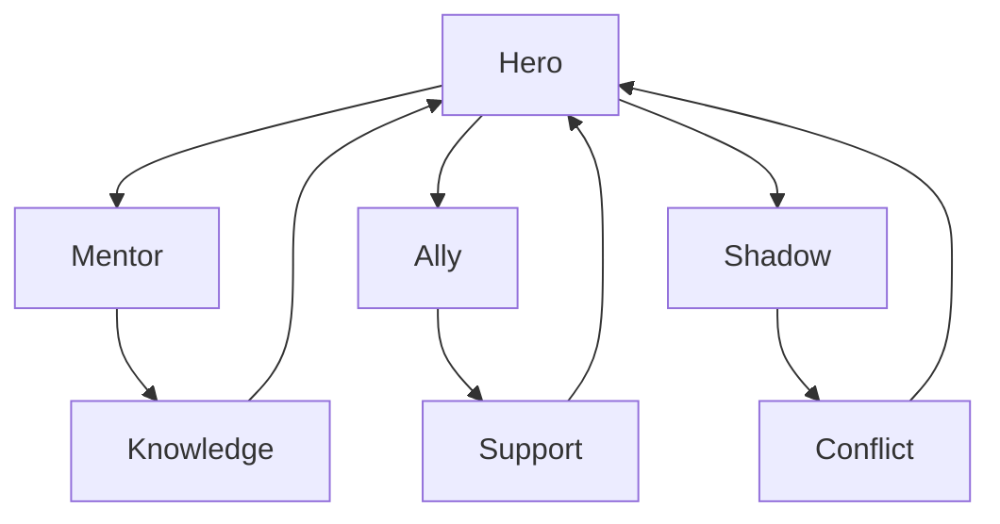

# Character Archetype Structure

Character Archetype は、物語に繰り返し現れる  
**役割的な人物型（キャラクター原型）**である。

これは心理タイプではなく、  
**物語内での機能（Narrative Function）**を表す。

同一人物が複数の原型を兼ねることも多い。

---

# 原型構造

---

# 主なキャラクター原型

## Hero（主人公）

物語の中心人物。

特徴

- 欠落を持つ
- 試練を受ける
- 変化する

機能

- 観客の視点
- 成長の担い手
- 主題の体現

---

## Mentor（導き手）

主人公に知識・助言・力を与える人物。

特徴

- 経験
- 知恵
- 保護

機能

- 主人公の成長を助ける
- 価値観を示す

例

- 師匠
- 先輩
- 年長者

---

## Ally（仲間）

主人公と協力する人物。

特徴

- 支援
- 共闘
- 相互理解

機能

- 主人公の補完
- 感情関係の形成

---

## Herald（呼びかけ）

物語の開始を告げる存在。

特徴

- 事件
- 使者
- 変化の兆し

機能

- 日常を破る
- 物語を始める

---

## Trickster（撹乱者）

秩序を揺さぶる存在。

特徴

- ユーモア
- 混乱
- 破壊

機能

- 緊張緩和
- 状況転換

---

## Shapeshifter（変転者）

立場や意図が不明確な人物。

特徴

- 信頼と疑い
- 立場変化
- 二面性

機能

- 緊張維持
- ミステリー要素

---

## Threshold Guardian（門番）

主人公の進行を阻む存在。

特徴

- 試験
- 防衛
- 制限

機能

- 主人公を鍛える
- 通過儀礼を作る

---

## Shadow（影）

主人公と対立する存在。

特徴

- 欲望
- 権力
- 破壊

機能

- 主題対立
- 危機の発生

---

# 原型の関係

---

# 分析テンプレート

作品：

---

## Hero

主人公は誰か。

---

## Mentor

導き手は誰か。

---

## Ally

仲間は誰か。

---

## Herald

物語を始めた存在は何か。

---

## Trickster

撹乱者は誰か。

---

## Shapeshifter

立場が揺れる人物は誰か。

---

## Threshold Guardian

最初の障害は何か。

---

## Shadow

主人公と対立する存在は誰か。

---

# 分析ポイント

- 同一人物が複数原型を持つか
- 原型が途中で変化するか
- 原型が逆転するか
- 原型配置がテーマにどう関係するか

---

# 注意

キャラクター原型は固定的ではない。

多くの作品では

- Mentor が Shadow に変わる
- Ally が裏切る
- Shadow が救済される

などの変化が起きる。

---

# まとめ

Character Archetype は

**物語内の人物を役割機能として分類する構造**

である。

これにより

- キャラクター配置
- 関係構造
- 主題対立

を明確に理解できる。