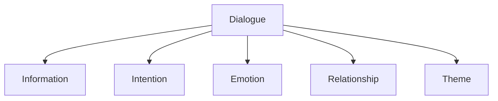
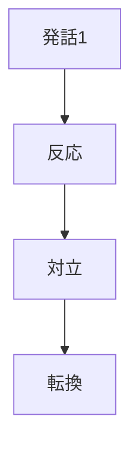
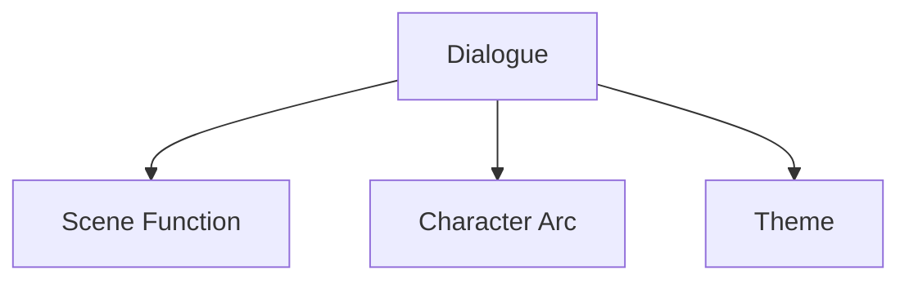

# Dialogue Structure

Dialogue Structure は、物語における会話の機能と構造を分析するための構造である。

会話は単なる情報伝達ではない。

優れた会話は次の要素を同時に持つ。

- 情報
- 感情
- 意図
- 関係変化
- 主題提示

したがって会話は、物語の重要な構成要素である。

---

# 会話構造

---

# 会話の主要機能

## Information（情報）

新しい事実を伝える。

例

- 設定説明
- 過去の出来事
- 状況報告

注意

説明過多になると退屈になる。

---

## Intention（意図）

人物が何かを得ようとしている。

例

- 説得
- 隠蔽
- 挑発
- 告白

会話の多くは意図の衝突である。

---

## Emotion（感情）

人物の感情が表れる。

例

- 怒り
- 悲しみ
- 喜び
- 不安

感情が強いほど印象に残る。

---

## Relationship（関係）

人物関係が変化する。

例

- 信頼
- 不信
- 親密
- 敵対

多くのドラマはここで動く。

---

## Theme（主題）

作品のテーマを示す。

例

- 人生観
- 世界観
- 価値観

テーマは会話で繰り返し提示されることが多い。

---

# 会話の基本構造

良い会話は

**発話 → 反応 → 対立 → 転換**

の流れを持つ。

---

# サブテキスト

会話にはしばしば

**言っていること**
と
**本当に言いたいこと**

の差がある。

これをサブテキストという。

例

表面  
「大丈夫だよ」

本音  
「助けてほしい」

サブテキストは会話を深くする。

---

# 会話分析テンプレート

シーン：

---

## 会話目的

この会話は何のためにあるか。

---

## 発話者の意図

人物A：

人物B：

---

## 情報

この会話で分かったこと。

---

## 感情

感情の変化。

---

## 関係変化

人物関係の変化。

---

## サブテキスト

言葉の裏にある意味。

---

## テーマ

作品テーマとの関係。

---

# 強い会話の特徴

- 情報と感情が同時に動く
- 意図が衝突する
- 関係が変化する
- サブテキストがある
- シーンを前進させる

---

# 弱い会話

## 1 説明だけ

設定説明のみ。

---

## 2 感情がない

人物が機械のように話す。

---

## 3 意図がない

何をしたい会話か不明。

---

## 4 変化がない

会話前後で関係が変わらない。

---

# 会話と物語構造

会話は

- シーン機能
- 人物変化
- テーマ

と密接に関係している。

---

# まとめ

Dialogue Structure は

**会話が物語の中でどの役割を果たしているかを分析する構造**

である。

会話を

- 情報
- 意図
- 感情
- 関係
- テーマ

の5つで見ることで、物語理解は大きく深くなる。