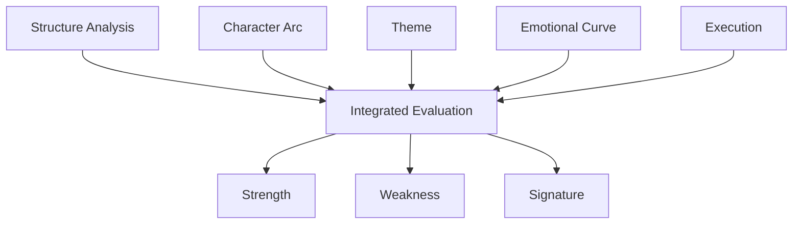

# Story Evaluation Structure

Story Evaluation は、物語分析の最終段階である。

ここでは

- 構造
- 人物
- テーマ
- 感情
- 演出

を統合し、その作品が**なぜ強いのか / 弱いのか**を判断する。

目的は単なる点数付けではない。

目的は

**作品の力学を理解すること**

である。

---

# 評価構造

---

# 評価観点

## 1 Structure

物語構造の強さを見る。

- 日常は明確か
- 欠落は切実か
- 動機は納得できるか
- 出発は自然か
- 中盤転換は意味転換になっているか
- 最大危機は深いか
- 解決はテーマと一致しているか

---

## 2 Character

人物の変化を見る。

- 主人公の欠落は明確か
- 誤解は説得力があるか
- 試練は誤解を揺らしているか
- 最大危機で旧い自己が崩壊しているか
- 最後に本当に変化したか

---

## 3 Theme

主題の明確さを見る。

- 題材とテーマが区別されているか
- 対立価値が存在するか
- 主人公の変化とテーマが一致するか
- 最終場面で主題が定着しているか

---

## 4 Emotional Curve

感情体験を見る。

- 序盤で興味が生まれるか
- 中盤で感情が更新されるか
- 最大危機で感情が沈むか
- 解決で解放されるか
- 余韻が残るか

---

## 5 Execution

演出・技術を見る。

- 演技
- 作画
- 映像
- 音楽
- テンポ
- 台詞
- 編集

---

# 評価テンプレート

## 構造評価

構造の特徴を書く。

---

## キャラクター評価

主人公と主要人物の変化を書く。

---

## テーマ評価

作品が何を語っているかを書く。

---

## 感情評価

感情体験を書く。

---

## 演出評価

演出面を書く。

---

# 強み

この作品の強みは何か。

---

# 弱点

この作品の弱点は何か。

---

# シグネチャ

この作品を一言で表す特徴を書く。

例

- 会話劇の強度
- 関係描写の精度
- 構造的サプライズ
- 視覚演出
- 世界観

---

# 総評

最後に作品全体の評価を書く。

---

# 注意

評価の目的は

**好き嫌いを書くことではない**

目的は

**作品の仕組みを理解すること**

である。