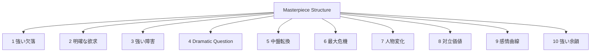
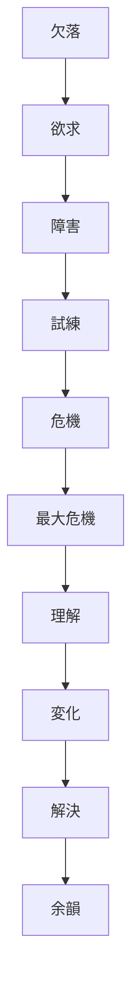

# Masterpiece Principles

名作は完全に自由な構造ではない。

多くの名作には共通する原理が存在する。

このノートは、物語分析から抽出された  
**名作の共通原理**をまとめたものである。

---

# 名作の10法則

---

# 1 強い欠落

名作の主人公は必ず何かを欠いている。

例

- 愛
- 居場所
- 自己理解
- 自由

欠落が弱いと物語は始まらない。

---

# 2 明確な欲求

主人公は何かを強く望んでいる。

例

- 恋人
- 勝利
- 真相
- 救済

欲求が強いほど物語は強くなる。

---

# 3 強い障害

欲求達成は簡単ではない。

障害には次がある。

- 敵
- 社会
- 自己の弱さ
- 誤解

障害が強いほどドラマが生まれる。

---

# 4 Dramatic Question

物語には中心質問がある。

例

- 主人公は勝てるのか
- 二人は結ばれるのか
- 真実は明らかになるのか

観客はこの答えを知りたくて物語を見る。

---

# 5 中盤転換

物語の意味が変わる瞬間。

例

- 真相発覚
- 目的変更
- 関係変化

中盤転換がないと物語は単調になる。

---

# 6 最大危機

主人公が最も追い詰められる瞬間。

例

- 全てを失う
- 裏切り
- 絶望

ここで感情が最大になる。

---

# 7 人物変化

主人公は物語の中で変化する。

例

- 成長
- 自己理解
- 誤解の修正

変化がない物語は浅くなる。

---

# 8 対立価値

名作は価値の衝突を描く。

例

- 自由 vs 安全
- 愛 vs 義務
- 正義 vs 友情

この対立がテーマを生む。

---

# 9 感情曲線

名作は強い感情曲線を持つ。

例

- 緊張
- 悲しみ
- 希望
- 解放

観客の感情が動き続ける。

---

# 10 強い余韻

名作は終わった後も残る。

例

- 思考
- 感情
- 人生観

余韻があるほど作品は記憶に残る。

---

# 名作構造

---

# 名作評価テンプレート

作品：

---

## 欠落

---

## 欲求

---

## 障害

---

## Dramatic Question

---

## 最大危機

---

## 人物変化

---

## テーマ

---

## 感情体験

---

## 余韻

---

# まとめ

名作は

- 強い欠落
- 強い欲求
- 強い障害
- 強い危機
- 強い変化

を持つ。

この構造が揃うと

**観客の感情と意味が最大化される。**