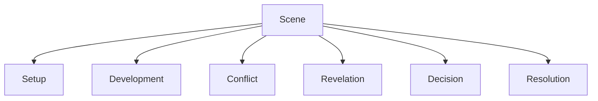
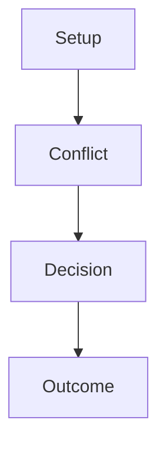
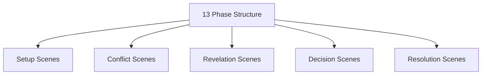

# Scene Function Structure

Scene Function は、物語の各シーンが  
**どの役割を果たしているか**を分析する構造である。

シーンとは単なる出来事ではない。

良い物語では、すべてのシーンが

- 情報
- 感情
- 変化
- 緊張

のいずれかを生み出している。

---

# シーン機能構造

---

# 主なシーン機能

## Setup（設定）

物語の前提を提示するシーン。

内容

- 世界観
- 人物
- 状況
- 関係

目的

観客が状況を理解すること。

---

## Development（展開）

状況を前進させるシーン。

内容

- 新しい情報
- 新しい関係
- 新しい問題

目的

物語を進める。

---

## Conflict（対立）

人物同士の衝突が起きるシーン。

内容

- 口論
- 対決
- 対抗行動

目的

緊張を生む。

---

## Revelation（発見）

新しい事実や理解が明らかになるシーン。

内容

- 真相
- 秘密
- 誤解の解消

目的

物語の意味を更新する。

---

## Decision（決断）

主人公が選択を行うシーン。

内容

- 行動決定
- 価値選択
- 覚悟

目的

物語を次の段階へ進める。

---

## Resolution（収束）

対立や問題が一旦収まるシーン。

内容

- 和解
- 成功
- 失敗
- 小休止

目的

物語のリズム調整。

---

# シーン構造

多くの良いシーンはこの構造を持つ。

---

# シーン分析テンプレート

シーン：

---

## シーン機能

- Setup
- Development
- Conflict
- Revelation
- Decision
- Resolution

---

## 何が変わったか

シーン前：

シーン後：

---

## 情報

このシーンで新しく分かったこと。

---

## 感情

観客の感情変化。

---

## 次のシーンへの影響

このシーンが次に何を生むか。

---

# シーン評価

良いシーンは次の特徴を持つ。

- 状況が変わる
- 情報が更新される
- 感情が動く
- 決断が生まれる

---

# よくある弱いシーン

## 1 情報だけの説明

説明だけで状況が変わらない。

---

## 2 変化がない

シーン前後で何も変わらない。

---

## 3 感情が動かない

観客の関心が停滞する。

---

## 4 次につながらない

物語の流れを作らない。

---

# 13フェイズとの関係

---

# まとめ

Scene Function は

**各シーンの役割を分析し、物語の進行メカニズムを理解する構造**

である。

これにより

- 無駄なシーン
- 弱いシーン
- 強いシーン

を明確に判断できる。