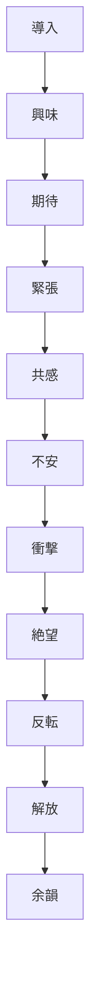
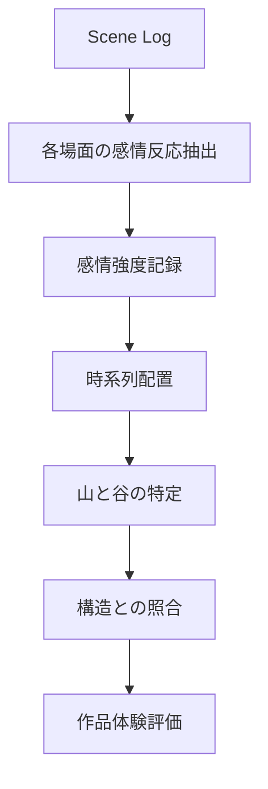
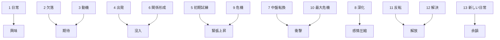

# Emotional Curve Structure

Emotional Curve は、作品鑑賞中に観客・読者の感情が  
**どこで上がり、どこで沈み、どこで解放されたか**を追う構造である。

物語の構造が正しくても、感情曲線が弱ければ「面白い」とは感じにくい。  
逆に、多少構造が粗くても、感情の上下が強ければ強い作品体験になる。

したがって鑑賞OSでは、論理構造だけでなく、  
**感情の運動**を別に追跡する必要がある。

---

# 基本構造

---

# 基本発想

感情カーブは、単純な「盛り上がり」の線ではない。  
実際には複数の感情が重なっている。

主に追うのは次の要素である。

- 興味
- 緊張
- 共感
- 不安
- 喜び
- 悲しみ
- 驚き
- 解放
- 余韻

作品によっては、笑い、恐怖、官能、崇高感などを追加してよい。

---

# 感情カーブの役割

## 1. どこで引き込まれたかを特定する
構造上の重要点と感情上の重要点が一致するかを見る。

## 2. どこで退屈したかを特定する
中だるみや感情停滞を可視化する。

## 3. どこで一番効いたかを把握する
最大危機、告白、対決、和解などの効き方を分析する。

## 4. 余韻の質を言語化する
見終わった後に何が残ったかを整理する。

---

# 感情分析フロー

---

# 感情カーブテンプレート

## 1. 場面ごとの感情記録

| 場面 | 興味 | 緊張 | 共感 | 驚き | 悲しみ | 解放 | メモ |
|---|---:|---:|---:|---:|---:|---:|---|
| 導入 |  |  |  |  |  |  |  |
| 序盤 |  |  |  |  |  |  |  |
| 中盤転換 |  |  |  |  |  |  |  |
| 危機 |  |  |  |  |  |  |  |
| 最大危機 |  |  |  |  |  |  |  |
| 解決 |  |  |  |  |  |  |  |
| 終幕 |  |  |  |  |  |  |  |

数値は 0〜5 程度でよい。

---

## 2. 山と谷

### 感情の山
最も強く感情が動いた場面を書く。

---

### 感情の谷
退屈、停滞、集中切れが起きた場面を書く。

---

## 3. 最大点

### 最も効いた場面
どの場面が最も強く刺さったか。

---

### なぜ効いたか
- 構造上の積み上げ
- キャラ関係
- 演出
- 音楽
- 台詞
- 意外性
- 個人的経験との接続

---

## 4. 終了後感情

- 爽快
- 切ない
- 苦い
- 救われる
- 不穏
- 静か
- 混乱
- 余韻が深い

---

# 13フェイズとの対応

感情カーブは13フェイズと対応して見ると強い。

---

# 見るべきポイント

## 1. 序盤で興味が立ち上がるか
設定説明だけで終わっていないか。

## 2. 中盤転換で感情が更新されるか
ここが弱いと後半が平坦になる。

## 3. 最大危機で本当に沈むか
感情の最低点が浅いと、反転が効かない。

## 4. 解決で十分に解放されるか
カタルシスの強さを見る。

## 5. 終幕で余韻が残るか
単なる終了ではなく、感情が定着しているかを確認する。

---

# 感情カーブの診断質問

- どこで一番引き込まれたか
- どこで退屈したか
- どこで一番傷ついたか
- どこで一番救われたか
- 最大危機は感情的にも最大だったか
- 解決の解放感は十分だったか
- 見終わった後に何が残ったか

---

# よくある失敗

## 1. 構造だけ見て感情を見ない
理屈では整っていても、体験として弱い作品を見逃す。

## 2. 自分の好き嫌いだけで判断する
感情反応を分解せず、総合印象だけで終わる。

## 3. 演出要因を切り分けない
感情が効いた理由が、構造なのか演出なのか分からなくなる。

## 4. 余韻を記録しない
終わった直後の感情は重要なデータである。

---

# 補助観点

感情カーブを見る際には、次も併用できる。

- BGMや無音の使い方
- カット割りや間
- 作画や表情
- 台詞の抑制 / 爆発
- 観客にだけ分かる情報差
- 伏線の回収タイミング
- 告白や対決の溜め

---

# まとめ

Emotional Curve とは、  
**観客・読者の感情運動を時系列に追い、どこで引き込み、どこで沈ませ、どこで解放したかを可視化する構造**である。

物語の評価は、骨格だけでは足りない。  
**感情の山と谷がどう設計されていたか**まで見て初めて、作品体験の強さを分析できる。